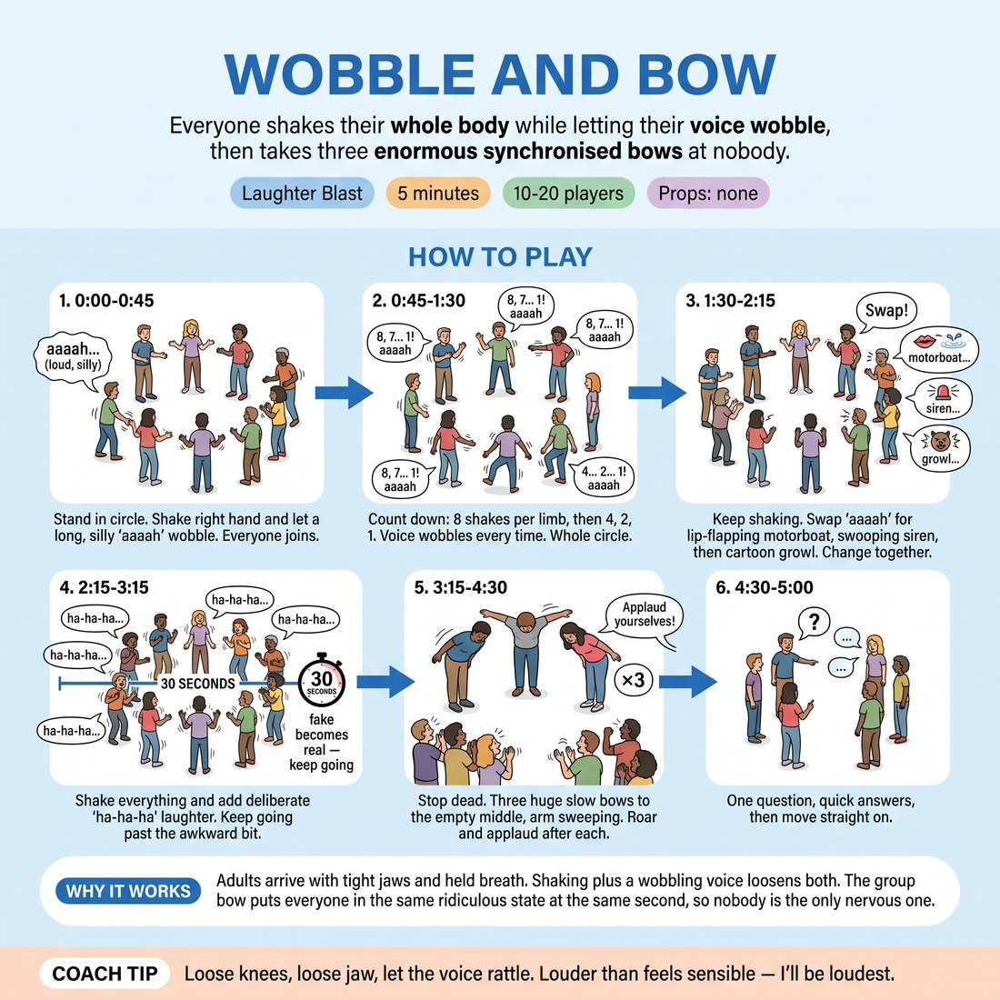

# Wobble and Bow

{ .infographic }

> Everyone shakes their whole body while letting their voice wobble, then takes three enormous synchronised bows at nobody.

`Players 10–20` · `~5 min` · `Complexity 1/5` · `Energy high` · `Contact none` · `Props: none`

## The point

Adults arrive on showcase day with tight jaws and held breath. Shaking plus a wobbling voice loosens both, and the group bow puts everyone in the same ridiculous state at the same second, so nobody is the only nervous one.

**Childhood borrow:** Making your voice wobble by shaking yourself, then bowing to imaginary applause.

## Setup

Standing circle, arm's length between people, shoes on. Push chairs and bags to the wall so nobody backs into furniture. No props.

## How to run it

1. 0:00-0:45 — Stand in the circle. Shake your right hand hard and let a long 'aaaah' wobble with it. Go louder and sillier than anyone else. Then everyone joins.
2. 0:45-1:30 — Count down together: eight shakes each limb with the wobbling 'aaaah', then four, then two, then one. Voice wobbles every time. Whole circle at once.
3. 1:30-2:15 — Keep shaking. Swap the 'aaaah' for lip-flapping motorboat noises, then a swooping siren, then a low cartoon growl. Call each change; everyone changes together.
4. 2:15-3:15 — Shake everything at once and add deliberate laughter: 'ha-ha-ha' on every wobble. Keep it going past the awkward bit. It usually turns real around thirty seconds.
5. 3:15-4:30 — Stop dead. Then three huge slow bows to the empty middle of the circle, arm sweeping, on your count. After each bow the whole room roars and applauds itself.
6. 4:30-5:00 — One question, quick answers, then move straight on.

## Side-coach

- *"Loose knees, loose jaw, let the voice rattle."*
- *"Louder than feels sensible — I'll be loudest."*
- *"Keep the laugh going, it catches up with you."*
- *"Bow lower. Sweep the arm. All the way down."*
- *"Applaud yourselves like you've never seen anything better."*

## Getting past the cringe

Start shaking and wobbling before you finish explaining. Do not look around to check whether people have joined — that reads as inspection. Stay at full volume for the whole first thirty seconds; the room joins on your commitment, not your instructions.

## Opt-down

Shake one hand only and let the wobble happen at a mumble, standing in the circle with everyone else. Bow from the waist with a small nod instead of the full sweep.

## If it stalls

- Drop the sound entirely for twenty seconds and just shake hard — silence plus violent wobbling usually breaks people first.
- Cut a variation. If motorboat lips land flat, go straight to the bows; they rescue almost every run.

## Ask afterwards

1. Where in your body do you feel that now? One word each, round the circle, go.

## Scale

| Class size | What changes |
|---|---|
| 10–13 | One circle. Run all three sound variations and three bows. |
| 14–17 | One wide circle. Cut the growl variation so the timings still fit. Still three bows. |
| 18–20 | Two circles of nine or ten, three metres apart. You stand between them and call for both. For the bows, the circles turn and bow to each other. |

## Safety & inclusion

Shake limbs, not the neck — heads stay still and jaws stay loose. Wobble the voice at conversational volume rather than pushing from the throat; nobody should be hoarse. Sit the bows out or bow from the waist only if you have back, knee or blood-pressure trouble, and let everyone know that's fine before you start. No contact at any point.

## Lineage

In the Laughter yoga tradition. Laughter yoga uses shaking and chanted 'ho-ho-ha-ha' to start deliberate laughter that becomes involuntary. Kept the shaking and the sustained fake laugh; dropped the chant and the breathing sequence, added the vocal wobble and the synchronised self-applauding bows so a showcase-week room ends up loud and pleased with itself rather than calm.
