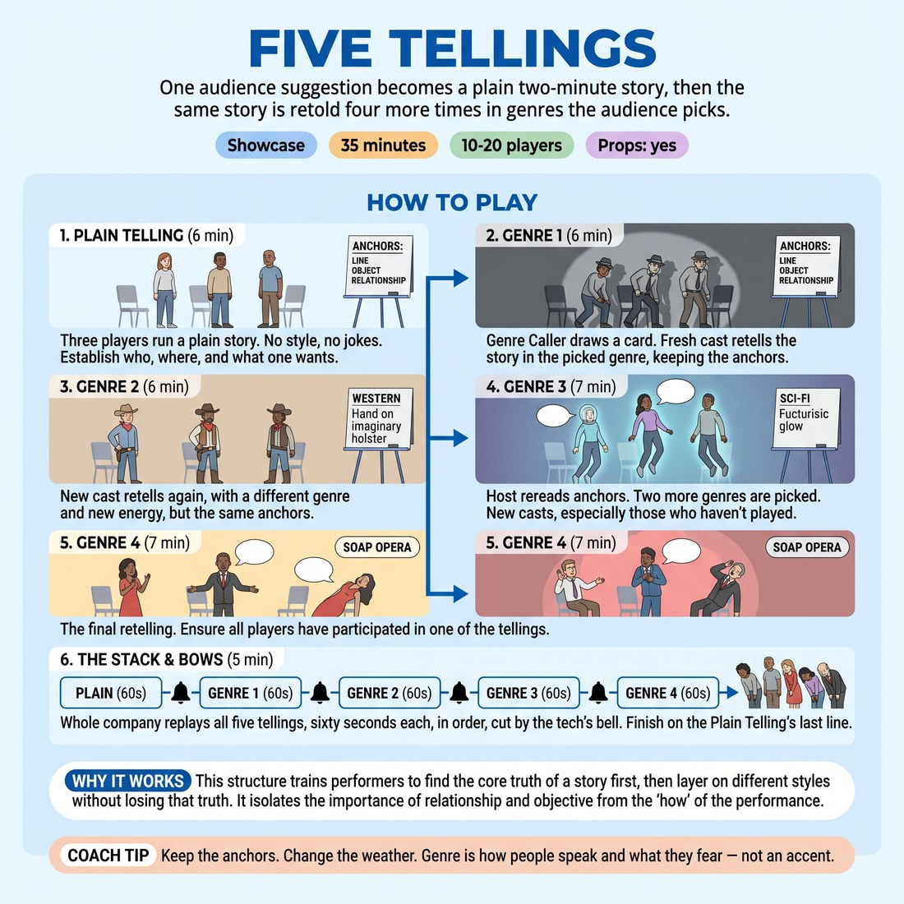

# Five Tellings

{ .infographic }

> One audience suggestion becomes a plain two-minute story, then the same story is retold four more times in genres the audience picks.

`Players 10–20` · `~35 min` · `Complexity 3/5` · `Energy medium` · `Contact incidental` · `Props: required`

## The show

The audience gives one ordinary thing — a bus pass, a leaking tap — and the company plays a plain, unhurried two-minute story from it. Three details go up on a board, and then the same story comes back four more times in genres the audience chooses: horror, western, courtroom, whatever the cards give up. The night ends with all five versions replayed at sixty seconds each, finishing on the line it started with.

## The night — 60 minutes

| Min | Segment | What happens |
|---:|---|---|
| 10 | **Doors and foyer** | Front of house seats people, hands out suggestion slips and pencils, collects them into the hat. House music, houselights up. |
| 5 | **Welcome and the draw** | Host explains the shape in three sentences, reads three slips aloud, takes the loudest applause as the suggestion. |
| 6 | **The Plain Telling** | Three players build a straight scene from the suggestion. No genre, no gags. Story Keeper writes three anchors on the board as they go. |
| 12 | **Genres one and two** | Genre Caller draws two cards, names each genre and its danger. Fresh casts retell the anchored story in each, roughly five minutes apiece with a music sting between. |
| 14 | **Genres three and four** | Host rereads the anchors. Two more cards drawn. Untouched players go on. The fourth telling is the largest cast of the night. |
| 8 | **The Stack** | Whole company replays all five tellings at sixty seconds each, bell-cut, ending on the Plain Telling's closing line. |
| 5 | **Bows and close** | One line of bows including tech and front of house. Host thanks the room, names the anchors, lights up, audience out to the foyer with the company. |

## Jobs

- Host and Story Keeper — welcomes, draws the suggestion, writes and rereads the three anchors
- Genre Caller — draws the cards, announces each genre and the danger inside it
- Board writer — keeps the anchors legible and visible to the back row all night
- Tech — bell, blackouts, four music stings, house and stage lights
- Front of house — door, slips, seating, latecomers, foyer at the end
- Company players and backline — cast for two tellings, provide doorways, weather and offstage sound for the others

## Setup

Playing area clear, chairs in a shallow arc for the audience, two chairs and a box on stage as the only set. A flipchart or whiteboard faces the audience for the three anchors, plus a hat of suggestion slips and a stack of eight genre cards. Tech desk at the side with a bell, a blackout switch and three or four music stings.

## How to run it

1. (10 min) Open doors. Front of house gives each arrival a slip: name one ordinary object or one dull errand. Collect them in the hat. No jobs, no puns.
2. (5 min) Host welcomes the room, explains the shape — one story, told five ways — draws three slips, reads them aloud, lets applause choose one.
3. (6 min) Three players run the Plain Telling. No style, no jokes. Establish who they are to each other, where they are, and what one of them wants.
4. (12 min) Story Keeper writes three anchors on the board: one spoken line, one object, one relationship. Genre Caller draws two cards. Fresh casts retell the story in each.
5. (14 min) Host rereads the anchors aloud. Caller draws two more genres. New casts each time; anyone who has not yet played goes on now.
6. (8 min) The Stack: whole company replays all five tellings, sixty seconds each, in order, cut by the tech's bell. Finish on the Plain Telling's last line.
7. (5 min) Bows in one line, tech and front of house included. Host names the three anchors once more, thanks the room, lights up, foyer open.

## Side-coach

- *"Keep the anchors. Change the weather."*
- *"Genre is how people speak and what they fear — not an accent."*
- *"Same story. Don't start a new one."*
- *"Say the anchor line before you get clever."*
- *"Slow down — the back row hasn't heard it yet."*

## How block 9 builds towards it

1. Weeks 1–2 (30 min): plain three-person scenes only, two minutes each. Who are we, where, what does one of us want. Then replay the same scene with one detail changed.
2. Weeks 3–4 (35 min): genre grammar. Teach the triple — how people speak, what the story looks at, what the danger is. Run one plain scene through three genres at ninety seconds each.
3. Week 5 (30 min): anchors. Someone writes three anchors live off a plain scene; the next cast must speak the line, use the object and keep the relationship. Drill the handover.
4. Week 6 (40 min): full shape on a class suggestion, timed. Then vote the eight genre cards and assign every role. Nobody leaves without a job.
5. Week 7 (40 min): dress run in performance order with tech cues, host script, bows and one outside guest watching. Fix the precast running order as a fallback.
6. Week 8 (35 min before doors): vocal and anchor drill, walk the bows, tech check, then perform.

## Looking after the audience

Front of house greets at the door, explains the slip in one line and says plainly that nobody will be brought onstage. Seat the arc close — the front row two metres back, not more. The Host's welcome states the running time, that there is no interval, and where the toilets are. Anchors stay on the board all night so anyone arriving late can follow. At the close the company comes down off the stage into the foyer rather than vanishing backstage; front of house holds the doors and thanks people out.

!!! warning "What makes it fail"
    The Plain Telling is the whole evening and it is the part most likely to go wrong. If that first cast hedges, jokes or never says what anybody wants, there is no story to retell, and the four genres become four unrelated sketches wearing hats — the audience stops tracking and the night flattens into noise by the third card. The second failure is accent-as-genre: players reach for a voice instead of a fear, and everything sounds like the same bad film. Both are rehearsal problems, not performance problems. Spend weeks one and two on plain scenes and refuse to move on early.

## If it stalls

- If the Plain Telling leaves the story vague, the Host asks that cast one question before they exit: 'Who wanted what?' Their answer becomes the third anchor.
- If a genre collapses into clichés, the Genre Caller names the danger out loud — 'In horror, someone is alone' — and the cast plays that instead of the style.
- If nobody steps up for a retelling, drop back to the precast running order fixed in week seven and call names.

## Ask afterwards

1. Which telling actually kept the story, and which one only kept the costume?
2. What did the audience recognise and enjoy most — the anchors or the genre?
3. Where did you feel safest onstage, and what made it safe?

## Scale

| Class size | What changes |
|---|---|
| 10–13 | Casts of three. Four genre retellings after the Plain Telling. Everyone plays exactly twice; two people run backline sound and doorways for each telling. The Stack uses the whole company at once. |
| 14–17 | Casts of four, with one walk-on slot per telling filled by whoever is offstage. Everyone plays once in a telling plus the Stack. Two people rotate onto the tech desk between genres so the operator also performs. |
| 18–20 | Casts of four plus a two-person narration desk at the side for each telling (they speak location and time only). Trim each retelling to two and a half minutes and add a fifth genre. The Stack is led by the four people who have played least. |

## Safety & inclusion

Genre cards exclude sexual violence, real atrocities and any style that runs on racial or national caricature; accents are not permitted as genre shorthand. Any contact — a grab, a lift, a stage death — is negotiated in rehearsal and repeated identically in the show, never improvised on the night. Horror runs with a slow fade, no strobe, no shouting into the front row. Anyone may pass on a telling by handing their card to the Genre Caller; no reason required.

## Lineage

In the Short-form 'play it again in another style' games, long standard in theatresports-style competitive shows and cabaret nights. tradition. The familiar version replays a scene in styles for points and speed. We removed the scoring, added a deliberately plain first telling with no jokes in it, and made three written anchors the thing every retelling must carry. That gives nervous players something concrete to hold and gives the audience a through-line to follow, so the evening builds instead of resetting.
