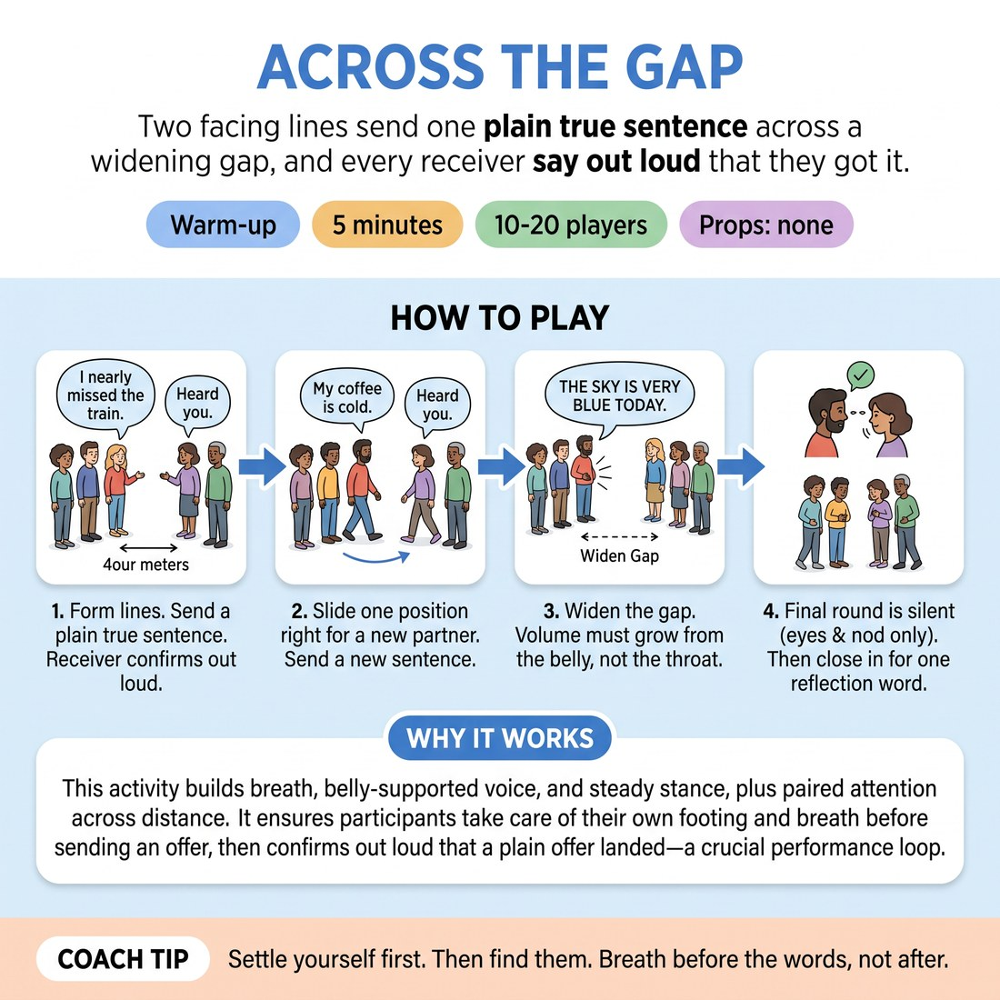

# Across the Gap

{ .infographic }

> Two facing lines send one plain true sentence across a widening gap, and every receiver says out loud that they got it.

`Players 10–20` · `~5 min` · `Complexity 2/5` · `Energy medium` · `Contact none` · `Props: none`

## What it warms

Breath, belly-supported voice and steady stance, plus paired attention across distance. It feeds D5.S3 by making people take care of their own footing and breath before they send anything, then confirm out loud that a plain offer landed — exactly the loop they need on a showcase stage.

**Role in the cluster:** connection

## Setup

Form two lines facing each other, about four metres apart, each person directly opposite a partner. Clear the floor between the lines. No props.

## How to run it

1. 45s. Set the lines. Tell everyone to pick one plain true sentence about today — 'I nearly missed the train.' No jokes needed. Nobody has to be interesting.
2. 60s. On your call, all at once: feet settled, one breath, find your partner's eyes, send the sentence across the gap. Receivers answer 'Heard you.' Two exchanges each.
3. 60s. One line slides one place to the right; the end person walks round to the far end. New partner, new sentence, same order — settle, breathe, look, send.
4. 60s. Both lines take one big step back. Slide again. Repeat with the wider gap. Volume grows from the belly, not the throat.
5. 45s. Silent round. Slide once more. Send the sentence with eyes and stance only; the receiver nods when they have genuinely got it.
6. 30s. Call the lines in. Ask for one word each on what changed when the gap widened. Move straight on.

## Side-coach

- *"Settle yourself first. Then find them."*
- *"Breath before the words, not after."*
- *"Send it to your partner, not to the floor."*
- *"If they didn't get it, that's information, not failure. Send it again."*
- *"Wider gap, lower and slower — not louder and faster."*

## Build it up

- Add a step back each slide until the lines are at opposite walls.
- Receivers stop saying 'Heard you' and instead repeat the sentence back word for word.
- Senders keep the sentence but must change one thing — pace, pitch or stillness — so the same words land differently.

## If it stalls

- If sentences get clever and competitive, ban anything that gets a laugh for one round. Plain only.
- If the room is too noisy to hear, halve the lines and run two rounds with the other half watching.

## Ask afterwards

1. What did you change in your body when the gap got wider?
2. When you couldn't hear your partner, what did you do about it?

## Scale

| Class size | What changes |
|---|---|
| 10–13 | One pair of lines, five to seven a side. Odd number: you take the spare place and play. Run three slides. |
| 14–17 | One pair of lines, seven to nine a side. Run four slides; the wider-gap round happens twice. |
| 18–20 | Split into two sets of facing lines at opposite ends of the room, five each side. You call the slides for both sets at once so they stay in time. |

## Safety & inclusion

Reaching the back of the room is breath and openness, not shouting — stop anyone straining their throat. Sustained eye contact can be uncomfortable; looking at a partner's forehead or chin is a full opt-out and nobody comments on it. No contact in this activity.

## Lineage

In the Actor-training projection drills in facing lines tradition. The traditional version tests volume alone. We added a spoken 'Heard you' from the receiver and a silent final round so the drill becomes a two-way connection rather than a shouting test, and so nerves get treated as something you settle before you speak.
