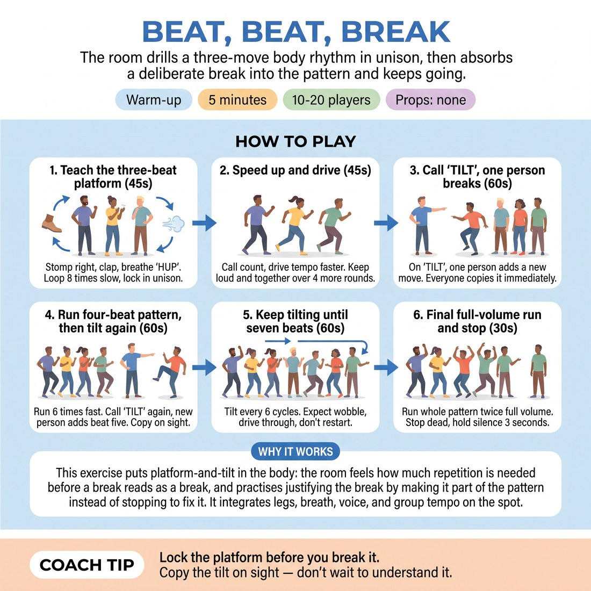

# Beat, Beat, Break

{ .infographic }

> The room drills a three-move body rhythm in unison, then absorbs a deliberate break into the pattern and keeps going.

`Players 10–20` · `~5 min` · `Complexity 2/5` · `Energy high` · `Contact none` · `Props: none`

## What it warms

Legs, breath, voice and group tempo, all on the spot. It puts platform-and-tilt in the body: the room feels how much repetition is needed before a break reads as a break, and practises justifying the break by making it part of the pattern instead of stopping to fix it.

**Role in the cluster:** activation

## Setup

Everyone stands scattered, facing you, with arm's length clear on all sides. No travelling — all movement happens on the spot. No props.

## How to run it

1. (45s) Teach the platform: stomp right, clap once, breathe out 'HUP'. Three beats. Run it eight times together, slow, until the room is locked in.
2. (45s) Speed it up. Call the count and drive the tempo faster over four more rounds. Keep it loud and keep it together.
3. (60s) Call 'TILT' and point at one person. On the next cycle they add one new move of their own on beat four. Everyone copies it immediately.
4. (60s) Run the four-beat pattern six times at speed. Then tilt again with a new person — beat five. Copy fast, no discussion.
5. (60s) Keep tilting every six cycles until the pattern is seven or eight beats long. Expect wobble; drive through it rather than restarting.
6. (30s) Final round: run the whole grown pattern twice at full volume, then stop dead on your cut. Hold the silence three seconds.

## Side-coach

- *"Lock the platform before you break it."*
- *"Copy the tilt on sight — don't wait to understand it."*
- *"One new move only. The rest of the pattern survives."*
- *"Louder on the breath. Let the room hear the rhythm."*
- *"Hold. Now the messy bit is the pattern."*

## Build it up

- Stop calling names — anyone may tilt, but only one person per cycle. The room has to read who is going.
- Tilt with a sound instead of a movement, so the pattern grows in voice as well as body.
- Every third cycle, drop the oldest beat as you add a new one. The pattern stays the same length but keeps changing shape.

## If it stalls

- If the pattern collapses into noise, drop the tempo by half and run the current version four times clean before tilting again.
- If a tilter freezes, give them the move yourself — 'clap above your head' — and move on. No one gets stuck inventing on the spot.
- If copying lags, cap the pattern at five beats and spend the remaining time on speed instead of length.

## Ask afterwards

1. What made the break easy to absorb — and what made one impossible?
2. Which version was more interesting to be inside: the clean three beats or the lopsided seven?

## Scale

| Class size | What changes |
|---|---|
| 10–13 | One block, everyone in. Tilt four times, so the pattern reaches seven beats. |
| 14–17 | One block, but tilt only three times — larger rooms need longer to copy. Choose tilters from opposite corners so heads have to turn. |
| 18–20 | Split into two halves facing each other across the room. Halves alternate: A runs the pattern while B watches, then B copies it back with one tilt added. Three exchanges each. |

## Safety & inclusion

Stomping and jumping load knees and ankles. Say up front that the stomp can be a heel tap and any move can be scaled down or done seated; no one has to match the room's size. Keep arm's-length spacing so nobody is struck by a neighbour's new move.

## Lineage

In the Ensemble rhythm and group-machine warm-ups common in physical theatre training tradition. The usual version builds a rhythm and keeps it clean. We made the break the point: a named person disrupts the locked pattern and the room's job is to fold the disruption in rather than reset. That is platform and tilt in the body before it is asked for in a scene.
