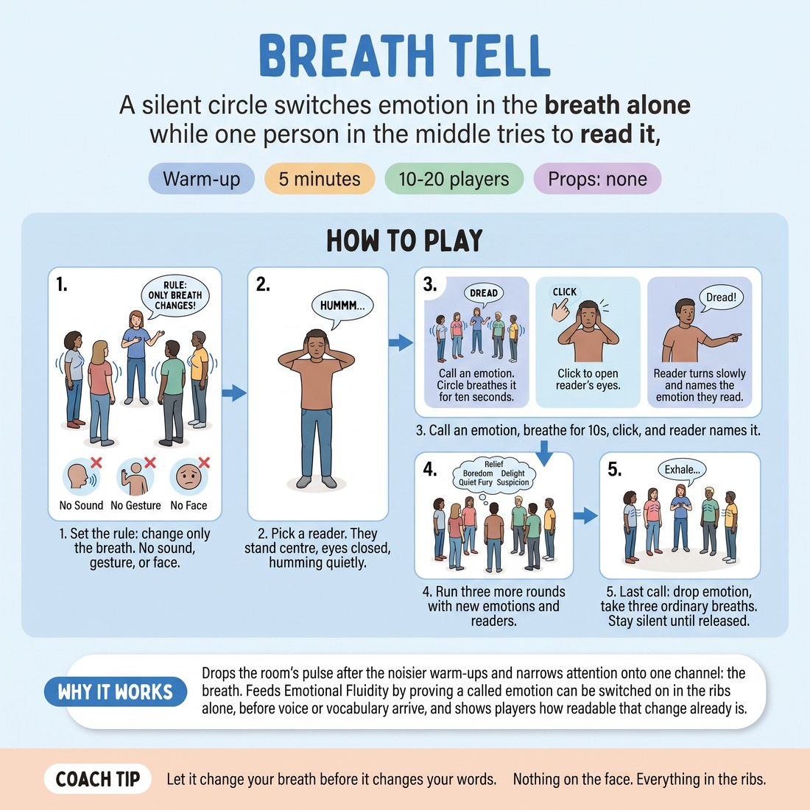

# Breath Tell

{ .infographic }

> A silent circle switches emotion in the breath alone while one person in the middle tries to read it.

`Players 10–20` · `~5 min` · `Complexity 2/5` · `Energy low` · `Contact none` · `Props: none`

## What it warms

Drops the room's pulse after the noisier warm-ups and narrows attention onto one channel: the breath. Feeds D1.S2 Emotional Fluidity by proving a called emotion can be switched on in the ribs alone, before voice or vocabulary arrive, and shows players how readable that change already is.

**Role in the cluster:** focus

## Setup

Standing circle, arms loose, enough gap that nobody is touching. One person stands in the middle. No props, no chairs needed.

## How to run it

1. (40s) Set the rule: when you call an emotion, only the breath may change. No sound, no gesture, no pulled face. Let it arrive in the ribs and stay there.
2. (20s) Pick a reader. They stand centre, eyes closed, hands over their ears, humming quietly so they can't hear you.
3. (55s) Say one emotion aloud to the circle. Give ten seconds of breathing it. Then click; the reader opens up, turns slowly, and names what they read.
4. (2m45s) Run three more rounds with new emotions and new readers. Suggested: dread, relief, boredom, quiet fury, delight, suspicion.
5. (20s) Last call: everyone drops the emotion, takes three ordinary breaths together, and the circle stays silent until you release it.

## Side-coach

- *"Let it change your breath before it changes your words."*
- *"Nothing on the face. Everything in the ribs."*
- *"Reader — take your time. Look at three people before you guess."*
- *"Shorter breath, higher up. That's the one."*
- *"Drop it. Ordinary breathing now."*

## Build it up

- Call two emotions back to back with a click between them; the reader must name both in order.
- Whisper a different emotion to each half of the circle; the reader names both and points to where the line falls.
- Cut the breathing time to five seconds, so the switch has to happen on the first breath.

## If it stalls

- If the circle drifts into acting with faces and shoulders, freeze them and run one round with hands resting on their own ribs, eyes on the floor.
- If readers guess wildly and the room deflates, say out loud that wrong guesses are the useful part, and ask the reader what they saw rather than what it was.

## Ask afterwards

1. Which emotion changed your breath fastest, and where did you feel it?
2. Reader — what were you actually looking at when you guessed?

## Scale

| Class size | What changes |
|---|---|
| 10–13 | One circle, one reader in the middle, four rounds. Everyone stays in. |
| 14–17 | One circle, four rounds. From round three, put two readers back to back in the middle; they must agree on a name before speaking. |
| 18–20 | Split into two circles of nine or ten, each with its own reader. Call the same emotion to both, quietly enough that only the circles hear. Three rounds each. |

## Safety & inclusion

No breath-holding at any point — keep air moving. Anyone who feels light-headed steps back and breathes normally; that is not a failure. Eyes-closed is optional for the reader; looking at the floor works just as well. No contact in this one.

## Lineage

In the Studio stillness and status-through-stillness work tradition. Built from the common practice of reading status and state from a held body. Stripped out face and gesture so the only channel left is breath, which is what this week's session is after, and added a reader in the middle so the room has to make the change legible rather than just feel it privately.
