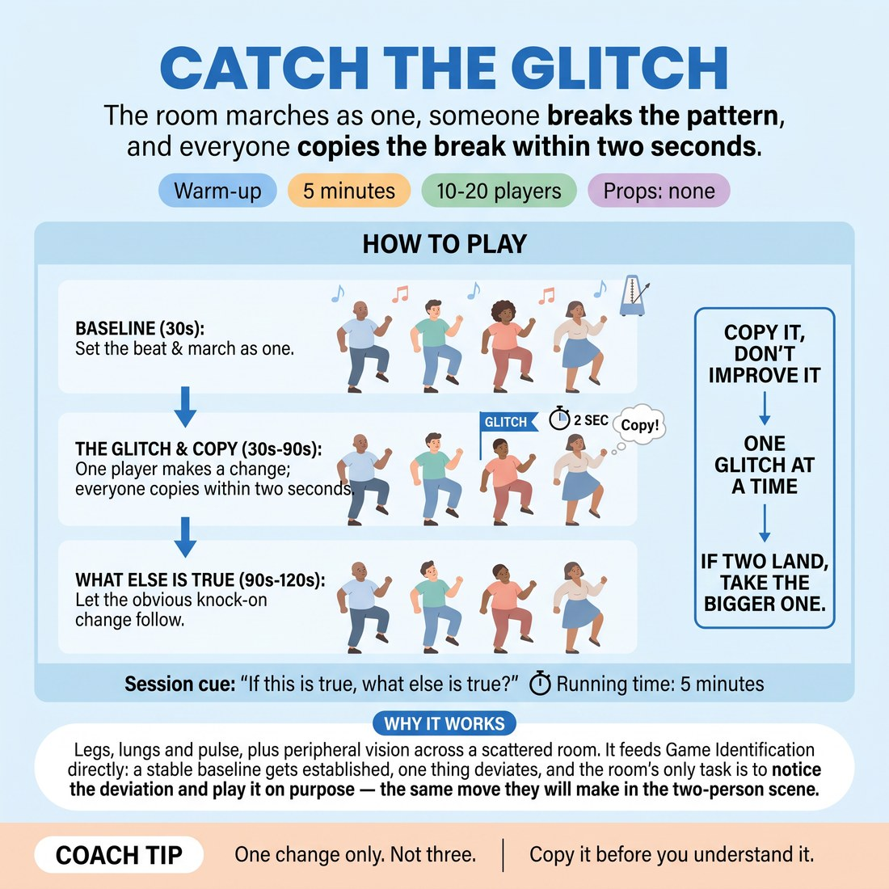

# Catch the Glitch

{ .infographic }

> The room marches as one, someone breaks the pattern, and everyone copies the break within two seconds.

`Players 10–20` · `~5 min` · `Complexity 2/5` · `Energy high` · `Contact none` · `Props: none`

## What it warms

Legs, lungs and pulse, plus peripheral vision across a scattered room. It feeds Game Identification directly: a stable baseline gets established, one thing deviates, and the room's only task is to notice the deviation and play it on purpose — the same move they will make in the two-person scene.

**Role in the cluster:** activation

## Setup

Scatter everyone across the floor, an arm's length apart in all directions, all facing you. No circle, no partners. Nobody travels — everything happens on the spot.

## How to run it

1. (30s) Set the baseline. Everyone marches on the spot, knees low, arms swinging, matching your tempo. Call "baseline" and clap the beat until the room locks together.
2. (30s) Give the rule. You call a name. That person changes one thing about the march — one limb, one angle, one rhythm. Everyone copies it within two seconds and keeps marching.
3. (90s) Round one. Call five or six names, roughly fifteen seconds apart. After each copy lands, call "and what else is true?" and let the room add the obvious knock-on change.
4. (90s) Round two. Stop calling names. Anyone may glitch. One glitch at a time — if two land together, the room takes the bigger one. Keep the tempo up.
5. (60s) Freeze the room mid-glitch. Ask three people to finish the sentence "we are all..." in six words. Shake the arms and legs out. Sit or stand for the next piece.

## Side-coach

- *"One change only. Not three."*
- *"Copy it before you understand it."*
- *"Hold the tempo — the baseline doesn't die."*
- *"Make it big enough to see from the back."*
- *"If this is true, what else is true?"*

## Build it up

- Add a sound to each glitch — the room copies movement and noise together.
- The glitcher heightens their own change on a count of three, and the room follows the heightening rather than the original.
- Allow two glitches at once and let the room choose without discussion which one to take; freeze and ask why that one won.

## If it stalls

- If glitches are too small to read, freeze the room, have the glitcher redo it at double size, then restart the march.
- If nobody volunteers in round two, go back to calling names for thirty seconds, then hand it over again.
- If people change four things at once, reset the baseline and restrict glitches to one joint below the waist.

## Ask afterwards

1. How quickly did you know which movement was the odd one?
2. What made a glitch easy to copy, and what made one confusing?

## Scale

| Class size | What changes |
|---|---|
| 10–13 | One block, everyone in. Call six names in round one so nearly everybody glitches once. |
| 14–17 | One block. Call five names in round one and accept that some people only copy — say so, so nobody waits for a turn. |
| 18–20 | Split into two blocks of nine or ten, facing each other across the room. Run both at once with their own glitches. For the last thirty seconds, block A freezes and copies block B. |

## Safety & inclusion

Low-impact marching only — no jumping, no travelling, no contact. Offer a seated version with arms alone, and tell the room at the top that anyone can drop to a walk-in-place at any point. Keep an arm's length of clear floor around each person.

## Lineage

In the Ensemble copying and follow-the-follower movement practice tradition. Group mirroring drills usually reward smooth unison. This version reverses the reward: the interesting moment is the break in unison, and the room's job is to spot it and commit to it fast. The \"and what else is true?\" call was added to tie it to the session cue.
