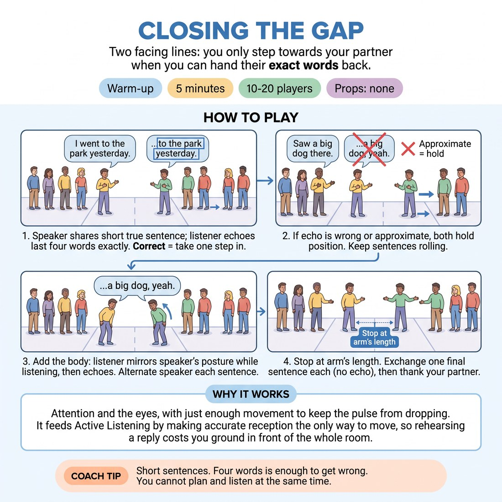

# Closing the Gap

{ .infographic }

> Two facing lines: you only step towards your partner when you can hand their exact words back.

`Players 10–20` · `~5 min` · `Complexity 2/5` · `Energy medium` · `Contact none` · `Props: none`

## What it warms

Attention and the eyes, with just enough movement to keep the pulse from dropping. It feeds Active Listening by making accurate reception the only way to move, so rehearsing a reply costs you ground in front of the whole room.

**Role in the cluster:** connection

## Setup

Clear a corridor down the middle of the room. Form two lines facing each other, six or seven big steps apart, each person opposite one partner. Nobody touches; the gap only ever closes to arm's length.

## How to run it

1. (40s) Set the lines and pair everyone across the gap. Rule: speaker says one short true sentence about their week. Listener repeats the last four words back, exactly.
2. (60s) Line A speaks, Line B echoes the tail. Correct echo, both take one step in. Wrong or approximate, both hold position. Keep sentences short and rolling.
3. (60s) Swap. Line B speaks, Line A echoes. Same stepping rule. Do not reset the distance already earned.
4. (90s) Add the body. Listener now copies the speaker's posture and lean while listening, then echoes the tail. Alternate speaker each sentence, keep stepping.
5. (50s) Stop at arm's length. Hold there. Last exchange: one sentence each, no echo, just receive it. Then thank your partner and turn out.

## Side-coach

- *"Short sentences. Four words is enough to get wrong."*
- *"You cannot plan and listen at the same time."*
- *"Let the words land before you open your mouth."*
- *"Copy the lean, not just the words."*
- *"If you missed it, hold your ground and ask for it again."*

## Build it up

- Extend the echo to the whole sentence, not just the last four words.
- Speaker adds a small gesture; listener must reproduce the gesture and the words together.
- Silent tail: speaker mouths the last two words. Listener must voice them correctly to step in.

## If it stalls

- Pairs run out of content. Give a frame: 'something you ate this week', 'something that took too long'.
- Echoes get sloppy and everyone races forward. Send the whole room back two steps and slow the tempo down.
- A pair is stuck at the far end and getting embarrassed. Tell them accuracy is the point, not distance, and let them finish where they are.

## Ask afterwards

1. What happened in your body the moment you stopped preparing a reply?
2. Which was harder to copy accurately: the words or the posture?

## Scale

| Class size | What changes |
|---|---|
| 10–13 | One corridor, one pair of lines. Odd number: you take the spare and play. |
| 14–17 | One corridor still, but widen the gap to eight steps so nobody collides at the finish. |
| 18–20 | Two parallel corridors, two facilitator calls. Run them simultaneously and keep the lines at least three metres apart. |

## Safety & inclusion

No contact at any point; the closing stops at arm's length and you call the stop. Anyone who prefers not to stand or step can play seated and nod their partner forward instead. Nothing disclosed needs to be personal — 'I bought milk' is a valid sentence.

## Lineage

In the Repetition and last-word listening drills from actor training, common in improv foundation classes tradition. The verbatim echo is standard. Attaching a physical step to accuracy is our change, so the room can see who is listening without anyone being corrected out loud.
