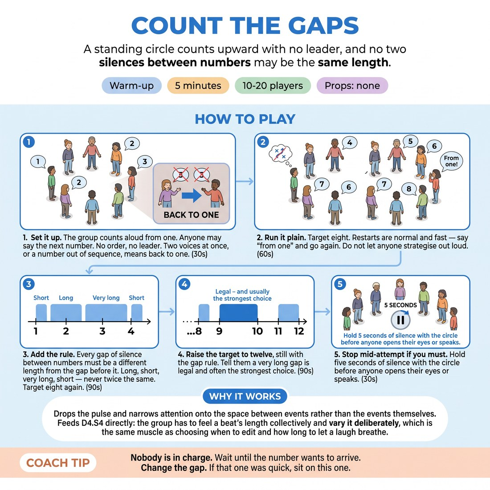

# Count the Gaps

{ .infographic }

> A standing circle counts upward with no leader, and no two silences between numbers may be the same length.

`Players 10–20` · `~5 min` · `Complexity 2/5` · `Energy low` · `Contact none` · `Props: none`

## What it warms

Drops the pulse and narrows attention onto the space between events rather than the events themselves. Feeds D4.S4 directly: the group has to feel a beat's length collectively and vary it deliberately, which is the same muscle as choosing when to edit and how long to let a laugh breathe.

**Role in the cluster:** focus

## Setup

Standing circle, arm's length apart, feet planted. No talking once you start. Offer eyes closed or eyes down on the floor in front of them — either works, nobody has to shut their eyes.

## How to run it

1. 30s: Set it up. The group counts aloud from one. Anyone may say the next number. No order, no leader. Two voices at once, or a number out of sequence, means back to one.
2. 60s: Run it plain. Target eight. Restarts are normal and fast — say 'from one' and go again. Do not let anyone strategise out loud.
3. 90s: Add the rule. Every gap of silence between numbers must be a different length from the gap before it. Long, short, very long, short — never twice the same. Target eight again.
4. 90s: Raise the target to twelve, still with the gap rule. Tell them a very long gap is legal and often the strongest choice.
5. 30s: Stop mid-attempt if you must. Hold five seconds of silence with the circle before anyone opens their eyes or speaks.

## Side-coach

- *"Nobody is in charge. Wait until the number wants to arrive."*
- *"Change the gap. If that one was quick, sit on this one."*
- *"Two voices — from one. No sighing."*
- *"Listen for the breath before the number, not the number."*
- *"Longer. You can hold it longer than that."*

## Build it up

- Ban the shortest gaps: every silence must last at least two full seconds. The count slows and the holding gets harder.
- Add a countdown — reach twelve, then come back down to one under the same gap rule.
- Remove the restart. A collision costs nothing; the group just keeps going. Watch whether the pacing gets sloppier without the penalty, then say so.

## If it stalls

- If the group cannot get past four, drop the gap rule for one round and rebuild the plain count first.
- If one or two people are saying every number, ask them to take the next round silently as listeners inside the circle.
- If restarts get grim, name it: the restart is the exercise, not the failure. Then start again immediately without comment.

## Ask afterwards

1. What told you it was your number — and what told you to wait?
2. Which gap in there felt best, and how long was it actually?

## Scale

| Class size | What changes |
|---|---|
| 10–13 | One circle. Target eight, then twelve. Expect four or five restarts. |
| 14–17 | One circle, slightly wider. Drop the second target to ten — more voices means more collisions, and twelve will eat the clock. |
| 18–20 | Two circles at opposite ends of the room. They alternate: one counts to eight while the other listens with eyes down, then swap. Two rounds each. |

## Safety & inclusion

Eyes closed is optional — looking at the floor is equally valid and nobody should be asked which they chose. Everyone stays planted; no walking with eyes shut. No physical contact in this one.

## Lineage

In the Group counting exercises used widely in ensemble theatre training and meditation practice tradition. The bare count-to-a-number-without-a-leader drill is old and everywhere. The addition here is the rule that no two silences may be the same length, which turns a listening exercise into a pacing exercise and makes holding a beat an active choice rather than a stall.
