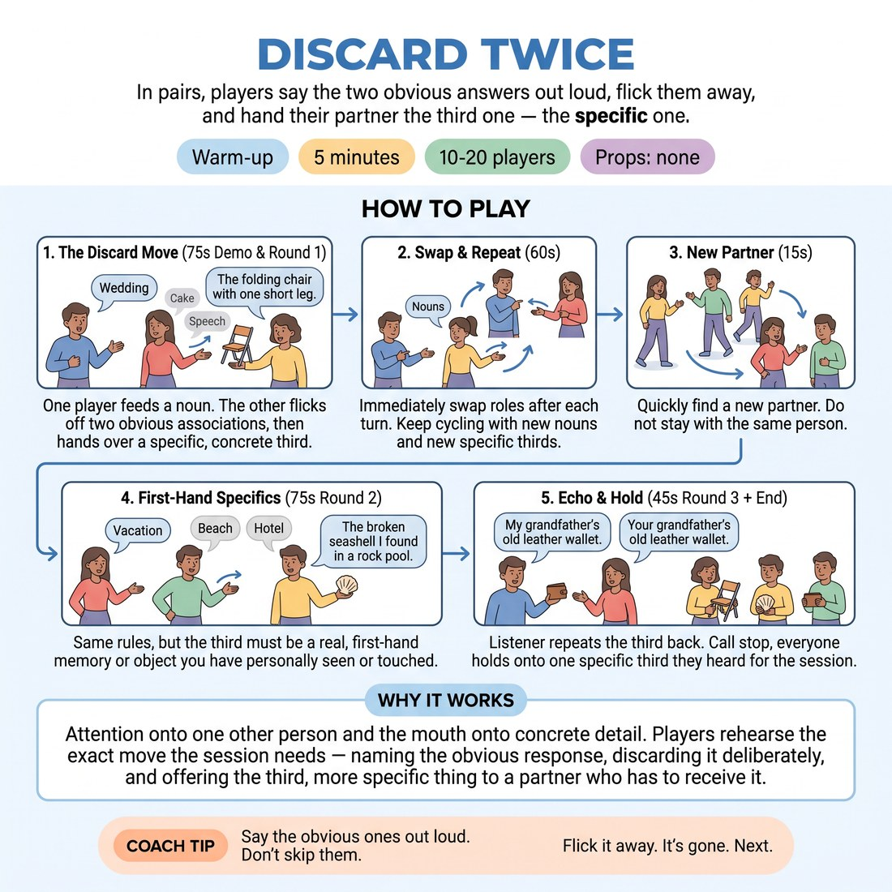

# Discard Twice

{ .infographic }

> In pairs, players say the two obvious answers out loud, flick them away, and hand their partner the third one — the specific one.

`Players 10–20` · `~5 min` · `Complexity 2/5` · `Energy medium` · `Contact none` · `Props: none`

## What it warms

Attention onto one other person and the mouth onto concrete detail. Players rehearse the exact move the session needs — naming the obvious response, discarding it deliberately, and offering the third, more specific thing to a partner who has to receive it.

**Role in the cluster:** connection

## Setup

Pairs standing face to face, an arm's length apart, spread around the room. No chairs, no props. Odd number: make one trio and give the third person the echo job described in step six.

## How to run it

1. (45s) Pair up. Explain: A says one plain noun. B holds out an open palm, says the two most obvious associations, and flicks each off the palm. Then B looks at A and gives a third.
2. (30s) Demo it once yourself with a volunteer. Noun: 'wedding'. Flick off 'cake', flick off 'speech', then land on something specific and small — 'the folding chair with one short leg'. Name that the third is concrete, not surreal.
3. (60s) Round one. A feeds a noun, B discards twice and lands the third. Swap roles immediately. Keep cycling with new nouns until you call time.
4. (15s) Everyone finds a new partner. Nobody stays where they are.
5. (75s) Round two. Same rules, but the third must be something the speaker has actually seen or touched. First-hand only.
6. (45s) Round three, same pairs. After the third lands, the listener repeats it back word for word before feeding the next noun.
7. (30s) Call stop. Ask everyone to hold on to one third they heard from a partner. Hand over to the session.

## Side-coach

- *"Say the obvious ones out loud. Don't skip them."*
- *"Flick it away. It's gone. Next."*
- *"The third is small and specific, not weird."*
- *"Look at your partner when you land it."*
- *"Echo it back exactly."*

## Build it up

- Discard three before landing, not two.
- Ban abstract nouns in the third — it must be something with a size, a texture or a smell.
- The listener feeds the next noun using a word from the third they just heard, so the pair builds a chain.

## If it stalls

- If people chase surreal answers, stop and reset: the third is a detail, not a joke. Point at the demo — a chair with a short leg, not a wedding on Mars.
- If pairs go silent hunting for the perfect third, drop the standard. Any specific thing counts. Speed over quality for the first round.
- If the flick gesture feels silly and they drop it, keep it. The hand is what makes the discard real rather than internal.

## Ask afterwards

1. What did you notice about the two you threw away — were they the same as your partner's?
2. Which was harder: finding the third, or saying the obvious ones out loud first?

## Scale

| Class size | What changes |
|---|---|
| 10–13 | Five or six pairs. Change partners once, at step four, as written. |
| 14–17 | Seven or eight pairs. Change partners once. Keep the same timings; you'll simply hear more overlap in the room. |
| 18–20 | Nine or ten pairs. Change partners once but shout the swap in five seconds — do not let it become a social milling. Volume will be high; give the noun prompts by calling one word to the whole room instead of letting A choose. |

## Safety & inclusion

No contact. Sustained eye contact is optional — anyone who prefers it can look at their partner's shoulder or hands, and say so at the start of the pair. Flick your own palm, not your partner's.

## Lineage

In the Word-association warm-ups from the North American improv teaching tradition tradition. Association drills usually reward the fastest first answer. Here the first answers are named, spoken and physically thrown away, so the discard is public rather than private. The hand gesture and the partner echo are ours, added to make it a two-person exchange rather than a solo brain exercise.
