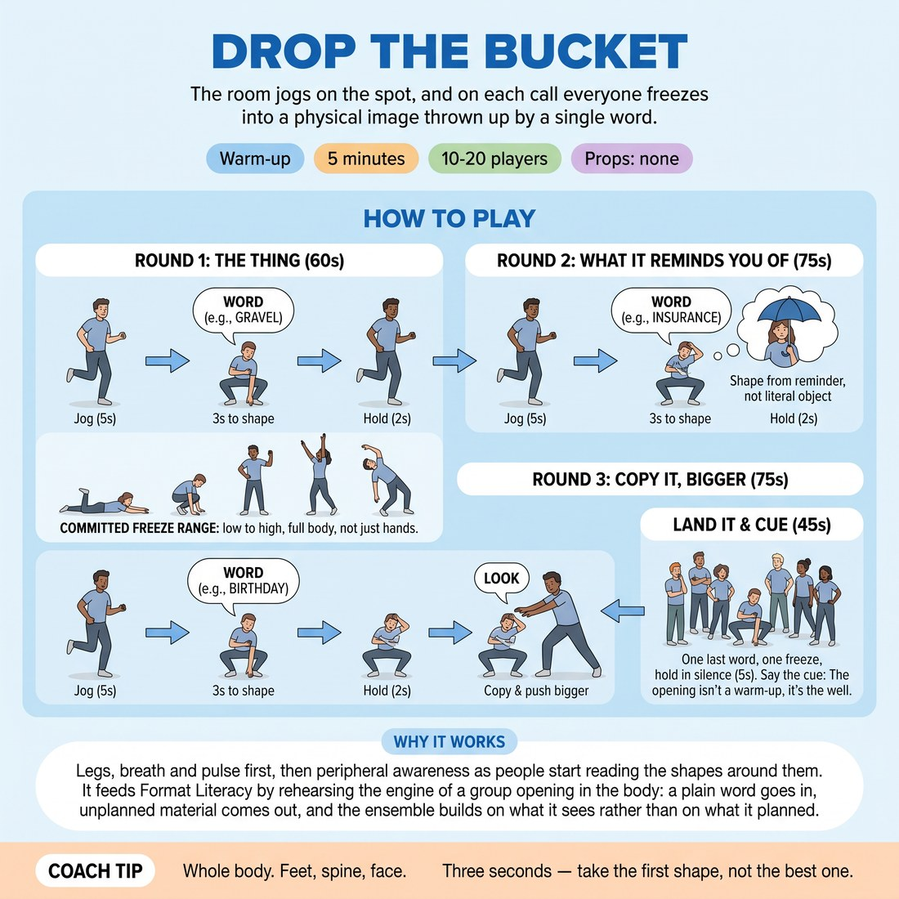

# Drop the Bucket

{ .infographic }

> The room jogs on the spot, and on each call everyone freezes into a physical image thrown up by a single word.

`Players 10–20` · `~5 min` · `Complexity 2/5` · `Energy high` · `Contact none` · `Props: none`

## What it warms

Legs, breath and pulse first, then peripheral awareness as people start reading the shapes around them. It feeds Format Literacy by rehearsing the engine of a group opening in the body: a plain word goes in, unplanned material comes out, and the ensemble builds on what it sees rather than on what it planned.

**Role in the cluster:** activation

## Setup

Clear the floor. Everyone spreads out at arm's length in all directions, facing you. Have four or five plain words ready — laundrette, gravel, insurance, birthday, tarmac.

## How to run it

1. Explain and demo (45s): everyone jogs on the spot. On your word plus 'freeze', they have three seconds to hit a full-body shape the word throws up. Hold two seconds, jog again.
2. Round one (60s): six words, plain shapes allowed. Jog five seconds between each. Push the freezes to be committed and low or high, not just a hand gesture.
3. Round two (75s): six words, but no literal object. The shape must come from something the word reminds them of. Same jog-and-freeze rhythm.
4. Round three (75s): after each freeze, call 'look'. They break the freeze, copy the nearest person's shape, and push it one size bigger. Then jog on.
5. Land it (45s): one last word, one freeze, hold it in silence for five seconds while they look around at the images the room made. Shake out.
6. Say the cue: the opening isn't a warm-up, it's the well. Every one of those shapes was a bucket coming up full.

## Side-coach

- *"Whole body. Feet, spine, face."*
- *"Three seconds — take the first shape, not the best one."*
- *"Don't check what anyone else did before you commit."*
- *"Look around. Steal the one nearest you and make it bigger."*
- *"Freeze means still. Breathe and hold."*

## Build it up

- Ban repetition — no shape may reuse a body position anyone has already made in that round.
- Add a sound on the freeze: one syllable, made at the same instant as the shape.
- Call two words at once and make them freeze into the collision of the two.

## If it stalls

- Shapes are staying small and polite — drop to two words and coach only size for a round: 'closer to the floor', 'higher than your head'.
- People are thinking too long. Cut the jog gap to three seconds so there's no time to plan.
- If a word gets blank looks, drop it and use a physical one — gravel, ladder, wind.

## Ask afterwards

1. Which of your shapes came from nowhere, and would you have found it sitting down?
2. When you copied someone and heightened it, what did that hand you that you didn't have alone?

## Scale

| Class size | What changes |
|---|---|
| 10–13 | One group, everyone in all the time. Run six words per round as written. |
| 14–17 | One group, but widen the spacing to two arms' length and cut to five words per round so the timings hold. |
| 18–20 | Split into two halves. Halves alternate rounds — one plays, one watches from the wall and calls out one image they saw before swapping. Four words per round. |

## Safety & inclusion

Jogging is optional: marching on the spot or shifting weight foot to foot counts, and anyone can sit a round out at the wall. No contact — freeze inside your own space and never lunge towards a neighbour. Warn about knees before any low shapes; nobody has to go to the floor.

## Lineage

In the Longform group-opening practice tradition. Physical freeze-on-a-word drills are common in longform training. Rebuilt here as an activation: the jog keeps the pulse up, the no-literals rule forces association rather than mime, and the copy-and-heighten round rehearses the harvesting move an ensemble makes inside a group opening.
