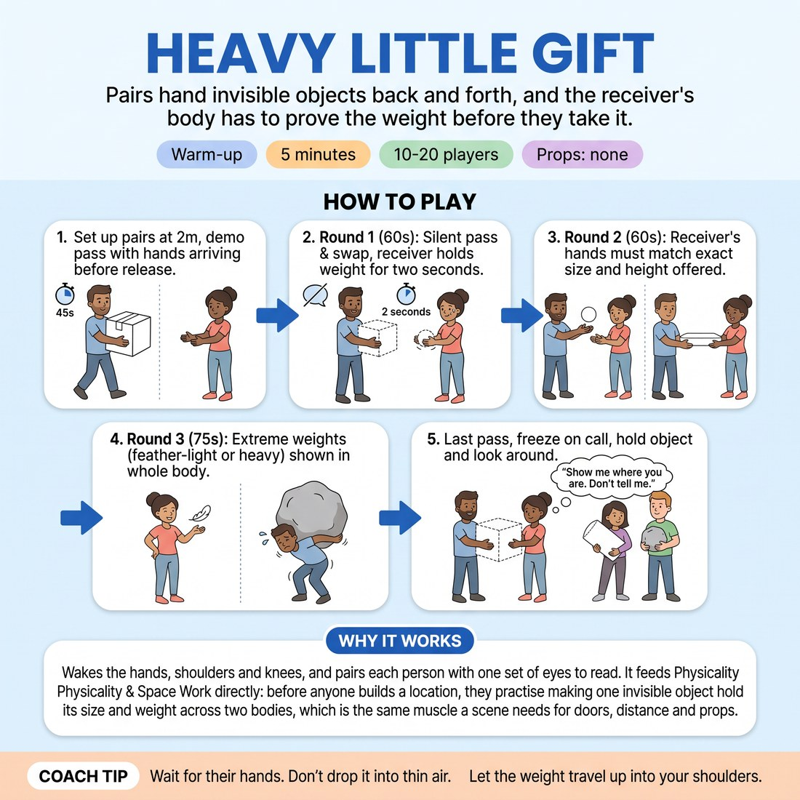

# Heavy Little Gift

{ .infographic }

> Pairs hand invisible objects back and forth, and the receiver's body has to prove the weight before they take it.

`Players 10–20` · `~5 min` · `Complexity 2/5` · `Energy medium` · `Contact none` · `Props: none`

## What it warms

Wakes the hands, shoulders and knees, and pairs each person with one set of eyes to read. It feeds Physicality & Space Work directly: before anyone builds a location, they practise making one invisible object hold its size and weight across two bodies, which is the same muscle a scene needs for doors, distance and props.

**Role in the cluster:** connection

## Setup

Pairs, facing each other, about two metres apart, spread around the room. Nobody touches anybody — every object is invisible and every handover happens across the gap. If numbers are odd, make one trio who pass in a triangle.

## How to run it

1. Set up (45s). Pairs face off at two metres. Demo once: lift something heavy, walk it over, hold it out, wait for your partner's hands to arrive before you let go.
2. Round one (60s). A hands B an object. B takes it, holds the weight for two seconds, then hands back something different. Silent. Keep swapping.
3. Round two (60s). Same swap, but the receiver's hands must arrive at the exact size and height the giver offered. If it slips, freeze and re-take it.
4. Round three (75s). Givers make the weight extreme — feather-light or barely liftable. Receivers show the strain or the lack of it in the whole body, not the hands.
5. Last pass and freeze (60s). One final object each way. Whoever holds it at the call, freeze holding it. Look around the room. Shake out.

## Side-coach

- *"Wait for their hands. Don't drop it into thin air."*
- *"Let the weight travel up into your shoulders."*
- *"Match the size they gave you, not the size you fancied."*
- *"Feet and knees know the weight too."*
- *"Two seconds of holding before you pass it on."*

## Build it up

- Add a breath sound on the effort — no words, just the exhale that matches the weight.
- Ban the hands from meeting the object first: receivers must arrive with a foot, a hip or a shoulder before the hands catch up.
- Pairs stop swapping objects and keep one, passing it back and forth while it slowly gets heavier every pass.

## If it stalls

- Objects stay generic and floppy. Call a category out loud — kitchen, workshop, hospital — and let them pull from it.
- Pairs rush. Say 'hold it for two seconds' and count the two seconds out for a few passes.

## Ask afterwards

1. What did your partner's body tell you about the object before you touched it?
2. When did the weight disappear, and what were you doing with your hands at that moment?

## Scale

| Class size | What changes |
|---|---|
| 10–13 | Five or six pairs, all four rounds as written. Odd number: one trio passing clockwise in a triangle. |
| 14–17 | Seven or eight pairs. Split the room into two halves so pairs have elbow room; run all four rounds, no changes. |
| 18–20 | Ten pairs in two rows down the room, facing across. Cut round two to 40 seconds and give the time to round three, so it stays five minutes. |

## Safety & inclusion

No contact at any point — hands come close, they don't meet. Nothing is actually lifted, so warn against genuine straining of backs or shoulders; the strain is performed, not real. Anyone who prefers not to crouch or reach low can play everything at chest height.

## Lineage

In the Common studio object-work and weight-passing warm-ups tradition. The familiar circle version passes one object round the group. Turned it into fixed pairs facing each other so the receiver has one person to read rather than a whole ring, and added the rule that hands must arrive at the offered size — that is the bit that makes it a connection exercise rather than a solo mime drill.
