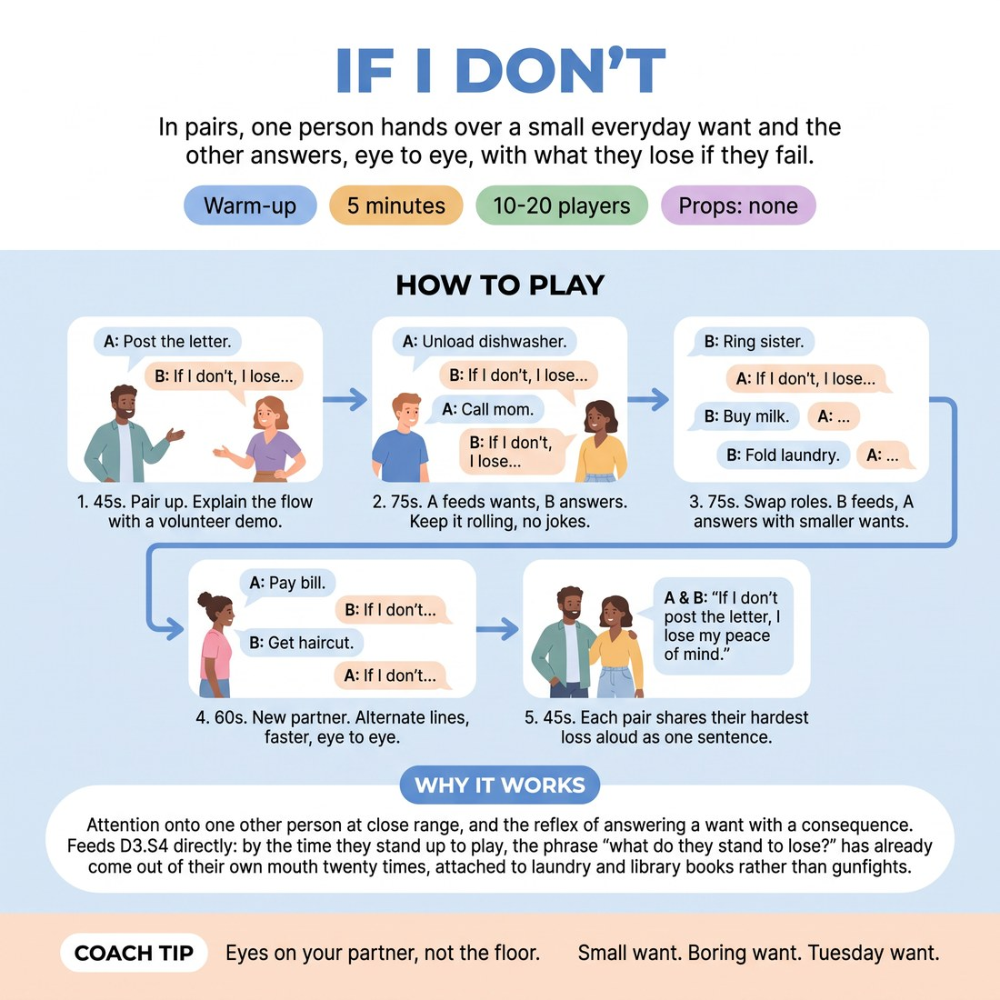

# If I Don't

{ .infographic }

> In pairs, one person hands over a small everyday want and the other answers, eye to eye, with what they lose if they fail.

`Players 10–20` · `~5 min` · `Complexity 2/5` · `Energy medium` · `Contact none` · `Props: none`

## What it warms

Attention onto one other person at close range, and the reflex of answering a want with a consequence. Feeds D3.S4 directly: by the time they stand up to play, the phrase "what do they stand to lose?" has already come out of their own mouth twenty times, attached to laundry and library books rather than gunfights.

**Role in the cluster:** connection

## Setup

Pairs standing face to face, about a metre apart, spread around the room. No chairs, no props. Odd number: make one trio where the giver feeds both partners in turn.

## How to run it

1. 45s. Pair everyone up. Explain: A gives B a small everyday want in one sentence. B answers straight back, holding eye contact: "If I don't, I lose..." Demo once with a volunteer.
2. 75s. A feeds wants, B answers. Keep it rolling — new want every few seconds, no discussion, no jokes about the answer. Aim for six or seven exchanges.
3. 75s. Swap roles. B feeds, A answers. Push for smaller wants than last round: post a letter, unload the dishwasher, ring your sister back.
4. 60s. New partner. Now alternate every line — you give a want, they answer, they give a want, you answer. Faster, still eye to eye.
5. 45s. Each pair picks the one loss that landed hardest. Go round the room, one pair at a time, saying it aloud as a single sentence. Then stop.

## Side-coach

- *"Eyes on your partner, not the floor."*
- *"Small want. Boring want. Tuesday want."*
- *"Name one thing you lose, not five."*
- *"Don't explain it. Say it and let it sit."*
- *"Something you can actually picture losing."*

## Build it up

- Ban the first answer. B must give a second, different loss before A moves on.
- The want and the loss must belong to the same fictional person — A adds a detail ("you're sixty-one, you live alone") and B answers in character.
- Cut the sentence stem. B answers with just the loss, no "if I don't" — one noun phrase, straight to the eyes.

## If it stalls

- People reach for death and disaster within thirty seconds. Call it: "Nothing fatal. What do you lose by Friday?"
- If a pair goes quiet, feed them a want yourself from across the room and let them answer it.
- If answers get abstract — "my dignity", "my self-respect" — ask for the object, person or place attached to it.

## Ask afterwards

1. Which losses made you actually want to watch that person try?
2. Did the small wants produce sharper losses than the big ones?

## Scale

| Class size | What changes |
|---|---|
| 10–13 | Run as written. The final lap goes round every pair, one sentence each. |
| 14–17 | Run as written, but cut the final lap to one loss per pair and keep it moving — no comment between them. |
| 18–20 | Split the room down the middle for the final lap and run both halves at once, each with a facilitator or a confident student calling the order. Everything before that is unchanged. |

## Safety & inclusion

No contact. Sustained eye contact at close range is uncomfortable for some people — say up front that looking at your partner's forehead or hands is a fine substitute, and anyone who wants to sit a round out can feed wants instead of answering.

## Lineage

In the Objective and stakes work from scene-study teaching, reduced to a two-line pair drill. tradition. Written from scratch for this slot. The common version has actors interrogate each other's scene objectives at length; this compresses it to one give and one answer so a room of twenty can run it in five minutes, and puts the want in the partner's mouth so nobody has to invent both halves.
