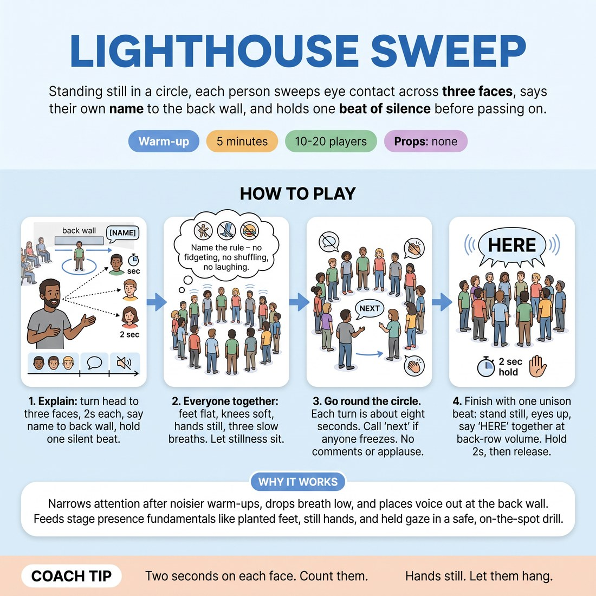

# Lighthouse Sweep

{ .infographic }

> Standing still in a circle, each person sweeps eye contact across three faces, says their own name to the back wall, and holds one beat of silence before passing on.

`Players 10–20` · `~5 min` · `Complexity 2/5` · `Energy low` · `Contact none` · `Props: none`

## What it warms

Narrows attention after the noisier warm-ups, drops breath low, and places the voice out at the back wall. It feeds D5.S3 by making the plain physical facts of stage presence — planted feet, still hands, held gaze, one clear line, one held beat — happen once each, on the spot, before anyone faces strangers.

**Role in the cluster:** focus

## Setup

One wide circle, arms' length apart, feet planted, hands hanging by the sides. No chairs, no props. Nobody walks during this one — the whole thing happens standing on the spot.

## How to run it

1. (45s) Explain: on your turn you turn your head to three faces across the circle, two seconds each, then say your own name loud enough for the far wall, then hold one silent beat.
2. (45s) Everyone together: feet flat, knees soft, hands still, three slow breaths. Name the rule — no fidgeting, no shuffling, no laughing it off. Let the stillness sit.
3. (2m 40s) Go round the circle in order. Each turn is about eight seconds. You call 'next' if anyone freezes. No comments, no applause between turns.
4. (30s) Finish with one unison beat: everyone stands still, eyes up, and says the word 'here' together at back-row volume. Hold two seconds of silence, then release.

## Side-coach

- *"Two seconds on each face. Count them."*
- *"Hands still. Let them hang."*
- *"Your name to the back wall, not to the floor."*
- *"Hold the silence after. Don't run off the end of it."*
- *"Feet planted. You are allowed to be looked at."*

## Build it up

- Second lap: after the name, hold three seconds of silence instead of one before passing on.
- Third lap: the speaker keeps eye contact with one single person for the whole turn, and that person holds it back without smiling.
- Final lap: name plus one plain true sentence, delivered to the person directly opposite, at back-row volume.

## If it stalls

- If the room giggles through it, stop, name it plainly — 'being looked at is uncomfortable, that's the exercise' — and restart the lap from the same person.
- If someone rushes their name and drops their eyes, ask for one repeat only, slower. Then move on. Don't drill a single person.
- If eye contact is too much for the room, switch everyone to the forehead or the gap between two heads for the first lap.

## Ask afterwards

1. Which was harder — being looked at, or holding the silence after your name?
2. What did your body do when three people looked back at you?

## Scale

| Class size | What changes |
|---|---|
| 10–13 | One circle, two laps. Second lap: name plus one plain sentence about today, still at back-row volume. |
| 14–17 | One circle, one lap, plus the unison 'here'. Keep turns to eight seconds and call 'next' briskly. |
| 18–20 | Split into two circles of nine or ten and run laps at the same time. Then reform one circle and take four volunteers who do their turn for the whole room before the unison 'here'. |

## Safety & inclusion

No contact. Sustained eye contact is intense for some people — offer the forehead or the space between two heads as an equal option, and say so before you start. Anyone may pass their turn with a nod and no explanation.

## Lineage

In the Ensemble focus circles common to actor training warm-ups tradition. Stillness-and-eye-contact circles are old and everywhere. We added the spoken name at back-row volume and the held silent beat afterwards, because showcase week needs people who can be looked at and keep standing there, not just people who can be quiet.
