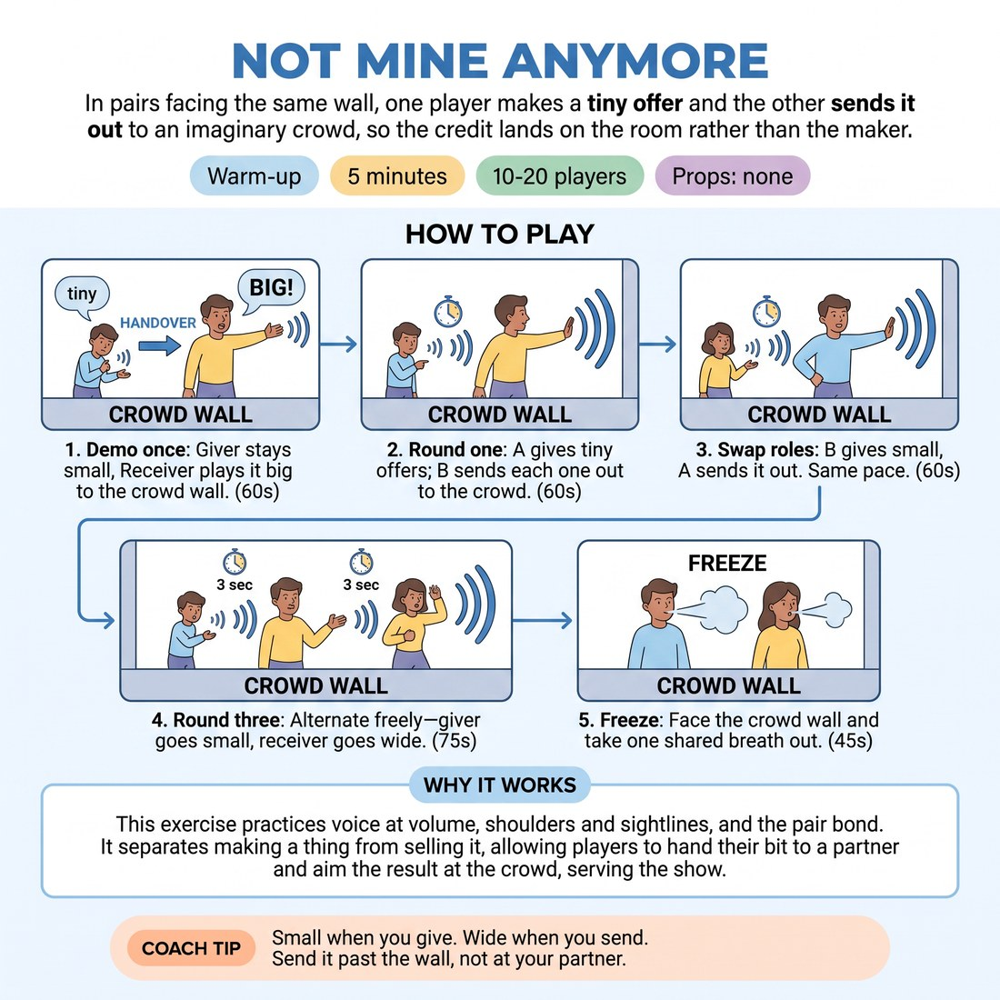

# Not Mine Anymore

{ .infographic }

> In pairs facing the same wall, one player makes a tiny offer and the other sends it out to an imaginary crowd, so the credit lands on the room rather than the maker.

`Players 10–20` · `~5 min` · `Complexity 2/5` · `Energy medium` · `Contact none` · `Props: none`

## What it warms

Voice at volume, shoulders and sightlines, and the pair bond. It feeds D5.S2 by separating making a thing from selling it — players practise handing their bit to a partner and aiming the result at the crowd, which is the cue for the whole session.

**Role in the cluster:** connection

## Setup

Clear one wall and call it the crowd. Pairs stand shoulder to shoulder, both facing that wall, with an arm's gap between them. No contact needed at any point.

## How to run it

1. Demo once with a volunteer: you make a small sound and gesture, they take the same shape and play it big to the back wall. Name the rule — the giver stays small. (60s)
2. Round one: A gives a tiny offer every few seconds, B receives each one and sends it out to the crowd wall. A never grows. (60s)
3. Swap. B gives small, A sends it out. Same pace, no talking about it between goes. (60s)
4. Round three: alternate freely, no fixed roles — whoever gives goes small, whoever receives goes wide. Aim for a clean handover every three seconds. (75s)
5. Call freeze. Everyone faces the crowd wall and takes one shared breath out towards it. Move straight on. (45s)

## Side-coach

- *"Small when you give. Wide when you send."*
- *"Send it past the wall, not at your partner."*
- *"Don't sell your own offer — let them sell it."*
- *"Faster handovers. Don't admire the last one."*
- *"Feet and face towards the crowd."*

## Build it up

- Add a rule: the receiver must land it and hold two seconds of stillness facing the wall before the next offer.
- Ban sound for a round — offers and sends are physical only, so clarity has to carry to the back.
- Merge two pairs into a four: one gives, three send it out together in unison.

## If it stalls

- Givers are performing instead of offering — cap them at one sound and one hand.
- If pairs get precious, call out a category for offers: kitchen noises, weather, animals.
- Odd number: make one trio where the third player only receives.

## Ask afterwards

1. What changed in the offer when someone else had to sell it?
2. Which felt harder — giving small or sending big?

## Scale

| Class size | What changes |
|---|---|
| 10–13 | Five or six pairs in one loose arc along the crowd wall. Run all three rounds as written. |
| 14–17 | Seven or eight pairs in two staggered rows, back row a step to the side so everyone has a sightline to the wall. Trim round three to 60 seconds. |
| 18–20 | Ten pairs in two arcs facing opposite walls; each arc has its own crowd wall so nobody is playing into someone's back. Cut round three to 45 seconds and keep the closing breath. |

## Safety & inclusion

No contact. Big vocal sends only — no screaming; anyone with a tired voice can gesture and mouth it. Give a standing opt-out to sitting at the side and receiving with voice only.

## Lineage

In the Short-form show warm-ups that train sending energy past the front row tradition. Originally authored for this slot. The common shape is a circle where an offer is passed round; we split it into pairs facing a shared imaginary audience so the direction of the send is outward, not inward, which is the habit a showcase week needs.
