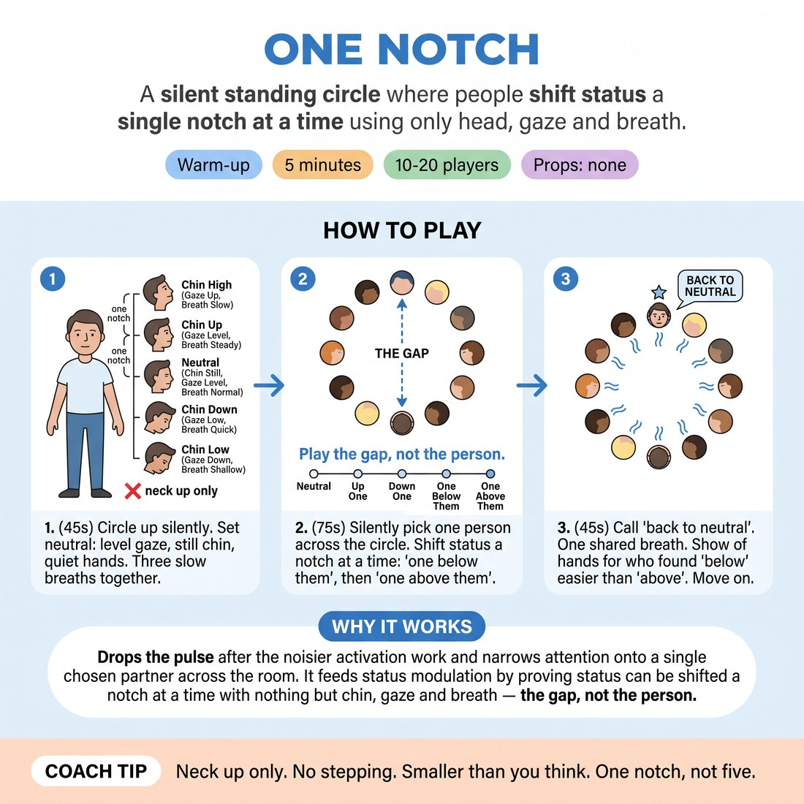

# One Notch

{ .infographic }

> A silent standing circle where people shift status a single notch at a time using only head, gaze and breath.

`Players 10–20` · `~5 min` · `Complexity 2/5` · `Energy low` · `Contact none` · `Props: none`

## What it warms

Drops the pulse after the noisier activation work and narrows attention onto a single chosen partner across the room. It feeds status modulation by proving status can be shifted a notch at a time with nothing but chin, gaze and breath — the gap, not the person.

**Role in the cluster:** focus

## Setup

One circle, arms' length apart, everyone facing in. No chairs, no props. The whole exercise is silent apart from your calls.

## How to run it

1. (45s) Circle up. Feet planted, arms loose, mouth closed. Tell them nobody speaks or steps for the next five minutes. Three slow breaths together.
2. (60s) Set neutral: level gaze, still chin, quiet hands, weight even. Count them into five seconds of complete stillness, then let them settle again.
3. (75s) Call 'up one notch' and 'down one notch' at roughly ten-second intervals. Changes come only from the neck up — chin height, gaze, blink rate, breath speed.
4. (75s) Each person silently picks one person across the circle without indicating who. Call 'one notch below them' — hold thirty seconds. Call 'one notch above them' — hold thirty seconds.
5. (45s) Call 'back to neutral'. One shared breath. Ask for a show of hands: who found below easier than above. Move on without discussion.

## Side-coach

- *"Neck up only. No stepping."*
- *"Smaller than you think. One notch, not five."*
- *"Keep breathing — held breath reads as panic, not status."*
- *"You're adjusting the gap, not becoming a different person."*
- *"Stillness is doing something. Stay in it."*

## Build it up

- Call notches faster — one every four seconds — so they stop planning and just adjust.
- Name a number aloud, 1 to 10, and have the room hit that status instantly from neutral with no ramp.
- Add one silent walker who crosses the circle at a chosen status while the rest hold theirs and track them with their eyes only.

## If it stalls

- Giggling and fidgeting are normal in the first minute. Do not scold. Just re-call neutral and shorten the holds to fifteen seconds.
- If nobody's change is visible, name one person who is reading clearly and let the room look at them for five seconds.

## Ask afterwards

1. Which was harder to hold still, high or low?
2. What did you actually change in your body to move one notch?

## Scale

| Class size | What changes |
|---|---|
| 10–13 | One circle. Run the full step 4 as written, thirty seconds each way. |
| 14–17 | One wide circle. Keep the same timings but drop the holds in step 4 to twenty seconds each way and add a third call, 'match them exactly'. |
| 18–20 | Split into two circles of nine or ten, five metres apart. Call for both circles at once from between them. Step 4 holds stay at thirty seconds; you will not see every face, and that is fine. |

## Safety & inclusion

No contact. Sustained eye contact is uncomfortable for some people — say up front that looking at a forehead, a collarbone or the floor is a full option, and that anyone can step to the edge of the circle and just stand.

## Lineage

In the Keith Johnstone's status teaching, particularly status held through stillness and eye behaviour. tradition. Johnstone's status work is usually played in moving scenes or with props. This strips it to a silent standing circle with movement banned below the neck, so the room finds status in gaze and breath rather than in blocking. Written from scratch as a five-minute focus piece.
