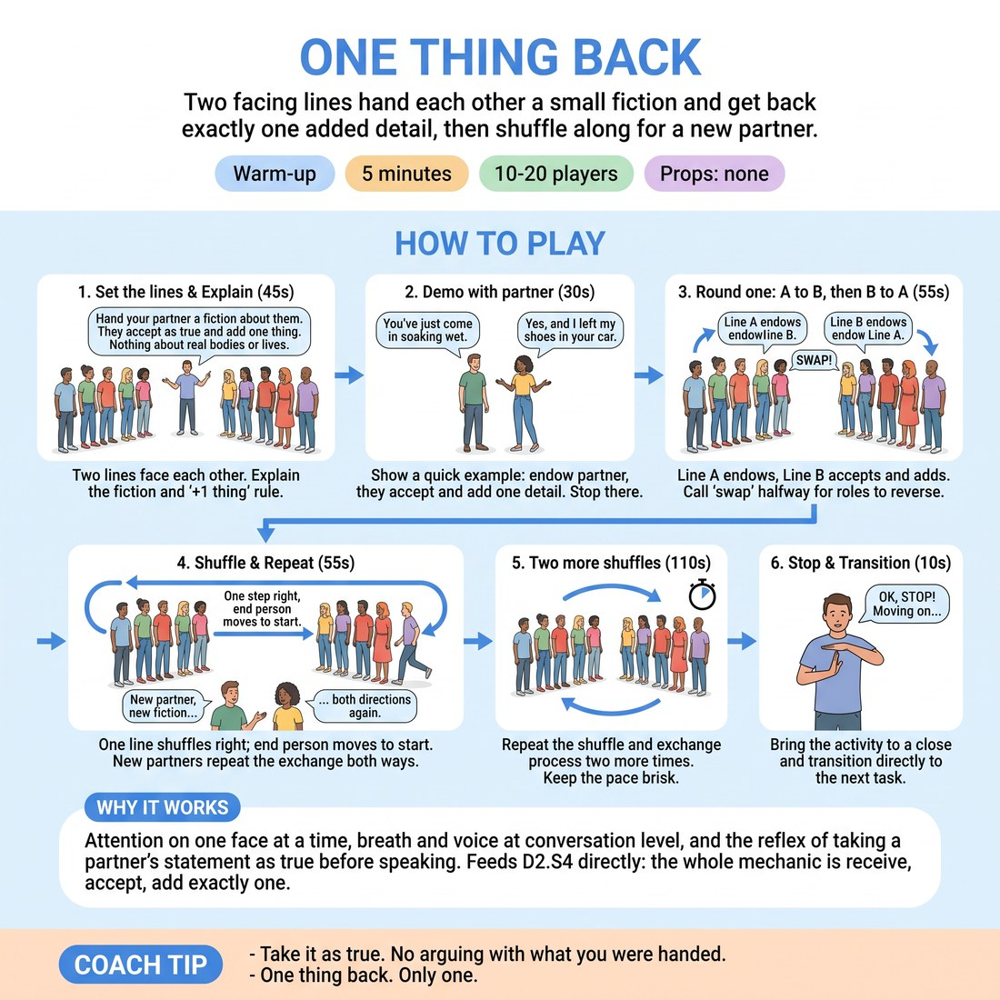

# One Thing Back

{ .infographic }

> Two facing lines hand each other a small fiction and get back exactly one added detail, then shuffle along for a new partner.

`Players 10–20` · `~5 min` · `Complexity 2/5` · `Energy medium` · `Contact none` · `Props: none`

## What it warms

Attention on one face at a time, breath and voice at conversation level, and the reflex of taking a partner's statement as true before speaking. Feeds D2.S4 directly: the whole mechanic is receive, accept, add exactly one.

**Role in the cluster:** connection

## Setup

Two lines facing each other, about a metre apart, everyone with a partner opposite. Clear the floor so the outer line can shuffle sideways. If the number is odd, stand in the line yourself.

## How to run it

1. Set the lines (45s). Explain: you hand your partner a fiction about them, they take it as true and add one thing. Nothing about real bodies or real lives.
2. Demo with the person opposite you (30s). Say 'You've just come in soaking wet.' They answer 'Yes, and I left my shoes in your car.' Stop there.
3. Round one (55s). Line A endows, Line B accepts and adds one thing. Call 'swap' at halfway so Line B endows and Line A adds.
4. Shuffle and repeat (55s). One line steps one place to the right; the person at the end runs to the far end. New partner, new fiction, both directions again.
5. Two more shuffles, same shape (110s). Keep the pace brisk — one exchange each way, then move on.
6. Call the line to a stop and hand straight into the next activity (10s).

## Side-coach

- *"Take it as true. No arguing with what you were handed."*
- *"One thing back. Only one."*
- *"Eyes up — say it to their face."*
- *"First thought is fine. Speed beats quality here."*
- *"Swap. Now the other side gives."*

## Build it up

- Add an emotion: the receiver accepts the fiction and delivers their one addition with a clear feeling attached.
- Make the endowment physical — a posture or gesture instead of a sentence — and the receiver names it in words, then adds one thing.
- On the final shuffle, the giver must reincorporate the addition in a second line, so the exchange runs three beats instead of two.

## If it stalls

- If pairs freeze, feed a starter out loud: 'You've just found something in your pocket.' Everyone uses it at once.
- If people add three things and keep talking, count them down — 'sentence, full stop, done' — and shorten the rounds to one exchange each.
- If the lines get noisy and nobody can hear, halve the volume by asking everyone to speak at conversation level, closer in.

## Ask afterwards

1. What was harder — handing something over, or taking what you were handed?
2. Did anyone quietly change the offer they were given instead of accepting it?

## Scale

| Class size | What changes |
|---|---|
| 10–13 | One corridor of five or six pairs. Four shuffles fits the time. |
| 14–17 | One corridor of seven or eight pairs. Three shuffles only, or the rotations overrun. |
| 18–20 | Split into two separate corridors of five pairs each, side by side, so voices stay audible. Run four shuffles in each; you walk between them. |

## Safety & inclusion

No contact. Endowments must be invented fictions — no comments on a partner's real appearance, accent, age or life. Anyone can say 'pass' and take a new offer instead; name that out loud before you start.

## Lineage

In the Endowment and 'Yes, And' pair drills common in North American improv teaching. tradition. Rebuilt as a two-line conveyor with a hard one-addition limit and a partner rotation, so it stays a connection warm-up rather than a scene exercise, and so nobody spends five minutes with the same person.
