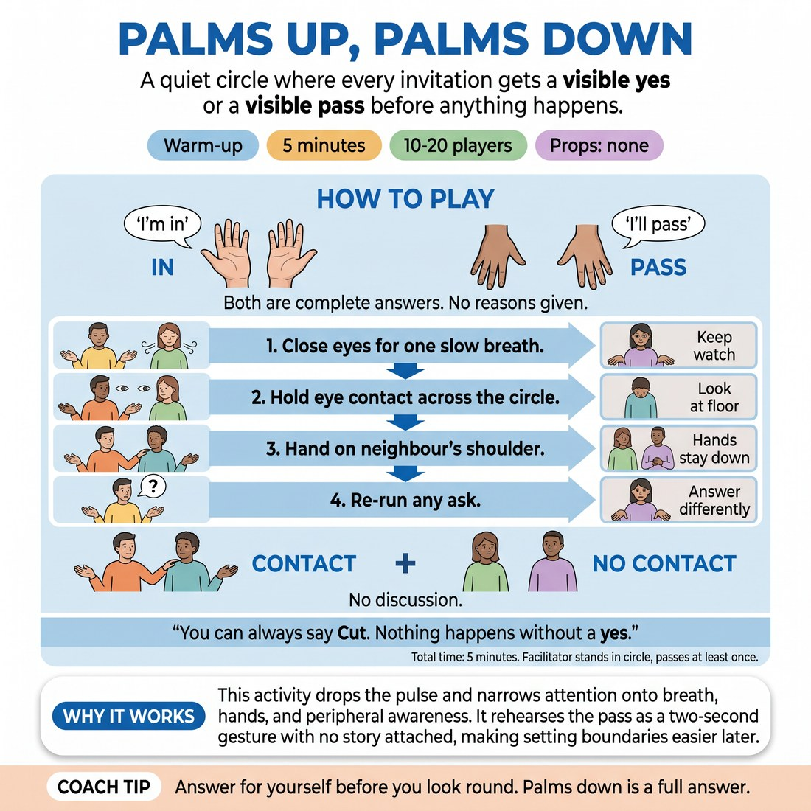

# Palms Up, Palms Down

{ .infographic }

> A quiet circle where every invitation gets a visible yes or a visible pass before anything happens.

`Players 10–20` · `~5 min` · `Complexity 2/5` · `Energy low` · `Contact negotiated` · `Props: none`

## What it warms

Drops the pulse after the laugh work and narrows attention onto breath, hands and peripheral awareness of the circle. It feeds D2.S6 by rehearsing the pass before anyone needs it: a boundary becomes a two-second gesture with no story attached, so later in the session saying no to an offer costs nothing.

**Role in the cluster:** focus

## Setup

One circle, everyone standing an arm's length apart, hands free at their sides. No props. You stand in the circle too, not in the middle.

## How to run it

1. (45s) Teach the signal. Palms turned up at hip height means "I'm in". Palms turned down means "I'll pass". Say both answers are complete and nobody explains either one.
2. (45s) First ask: "Close your eyes for one slow breath." Everyone shows palms. Wait three seconds. Then run it. Palms-down people stay open-eyed and keep watch.
3. (60s) Second ask: "Hold eye contact with one person across the circle for five seconds." Palms first, then find your person. Anyone showing palms down looks at the floor in the centre.
4. (75s) Third ask: "A hand on your right-hand neighbour's shoulder." Both people must show palms up. One palm down means both keep hands to themselves. Ten seconds, then release.
5. (45s) Offer one re-run of any ask. Say people may answer differently this time and that changing your mind is allowed and unremarkable. Run whichever ask the room seems slowest on.
6. (30s) Hands down. One shared breath in the silence. Say the cue: you can always say Cut, and nothing happens without a yes.

## Side-coach

- *"Answer for yourself before you look round."*
- *"Palms down is a full answer."*
- *"Take the second you need."*
- *"Nobody comments on anyone's hands."*
- *"Cut still works, even mid-round."*

## Build it up

- Hand the asking over: a participant proposes the next ask instead of you.
- Allow mid-round changes — anyone may flip their palms while the ask is running, and the room adjusts around them without comment.
- Make an ask that needs two yeses from people who are not neighbours, so they must find each other and read each other's hands first.

## If it stalls

- If everyone says yes to everything out of politeness, show palms down yourself on the next ask and move straight on.
- If the room rushes the signal, slow your count out loud: palms, two, three, then go.
- If the contact round goes tense, drop it to a hand hovering an inch above the shoulder and keep the same yes/no mechanic.

## Ask afterwards

1. Was the pass harder to show than the yes?
2. What did you notice in the second before you chose?

## Scale

| Class size | What changes |
|---|---|
| 10–13 | One circle. Run all three asks plus the re-run, and add a fourth ask: say your own name to the circle. |
| 14–17 | One circle. Run all three asks. Cut the re-run to one ask only so the timing holds. |
| 18–20 | One circle, but the circle is wide, so swap the across-the-circle eye contact for eye contact with your left-hand neighbour. Skip the re-run. |

## Safety & inclusion

The shoulder round involves touch and needs both people showing palms up; one palm down means no contact, no discussion. Touch is shoulder only, over clothing, ten seconds. Anyone may lower their palms at any point, step back from the circle, or call Cut. Do not ask why anyone passed and do not let the room comment on choices.

## Lineage

Written for this slot. It borrows the habit of a visible check-in signal from consent practice in rehearsal rooms, then makes the signal the whole activity rather than a preamble to one.
