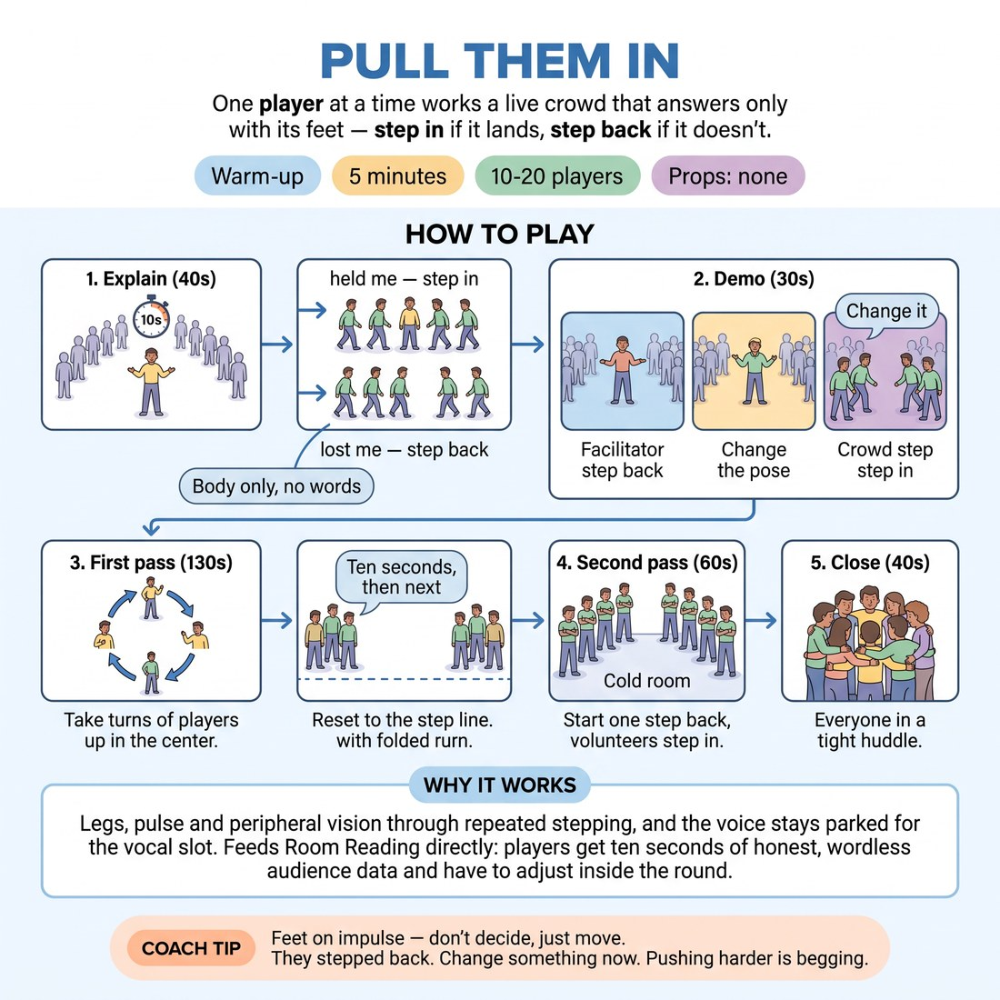

# Pull Them In

{ .infographic }

> One player at a time works a live crowd that answers only with its feet — step in if it lands, step back if it doesn't.

`Players 10–20` · `~5 min` · `Complexity 2/5` · `Energy high` · `Contact none` · `Props: none`

## What it warms

Legs, pulse and peripheral vision through repeated stepping, and the voice stays parked for the vocal slot. Feeds Room Reading directly: players get ten seconds of honest, wordless audience data and have to adjust inside the round, which is exactly what Match Play demands under the clock.

**Role in the cluster:** activation

## Setup

Clear the floor. Stand the group in a wide arc facing one empty spot, about three metres back, with room to step forwards and backwards twice. No chairs, no props.

## How to run it

1. Explain (40s): the player in the middle has ten seconds to hold the crowd with body only. The crowd answers with feet — step in if held, step back if not.
2. Demo (30s): stand in the middle yourself. Do something flat, let them step back, change it, pull them in. Name the moment you adjusted.
3. First pass (130s): go round the arc, ten seconds each, you call 'next' hard on time. Crowd resets to the start line between players.
4. Second pass (60s): crowd now starts one step back, arms folded. Players must earn the first step in. Six to eight volunteers only, ten seconds each.
5. Close (40s): everyone step in to the tightest possible huddle, one shared breath out, then straight into the next warm-up.

## Side-coach

- *"Feet on impulse — don't decide, just move."*
- *"They stepped back. Change something now. Pushing harder is begging."*
- *"Half a step is an answer. Take it."*
- *"Earn the laugh, never beg for it."*
- *"Ten seconds. Read them by second three."*

## Build it up

- Allow one repeated sound per player alongside the body — no words, no sentences.
- Put two players in the middle sharing one crowd; they must cooperate to hold it, and a step back punishes both.
- Crowd starts against the back wall and moves in half-steps only, so the player has to sustain the pull for the full ten seconds instead of scoring one hit.

## If it stalls

- If the crowd goes polite and everyone steps in for everyone, tell them flatly that lying makes the game useless, and run three players where nobody is allowed to step in until second five.
- If players freeze in the middle, give them a starting move — a repeated gesture, a walk, one shape held — and let them adjust from there rather than invent from nothing.

## Ask afterwards

1. What did the crowd's feet tell you that a laugh wouldn't have?
2. When you lost them, what did you change — and did you change it or just do more of it?

## Scale

| Class size | What changes |
|---|---|
| 10–13 | One arc. Ten seconds each, everyone plays both passes. You keep time for the single group. |
| 14–17 | Split into two arcs of seven to nine at opposite ends of the room, facing away from each other. Both run at once; call 'next' for both. Second pass, six volunteers per arc. |
| 18–20 | Two arcs, first pass only — ten seconds each still fits. Skip the second pass and finish with two volunteers playing to the whole room combined, twenty seconds each. |

## Safety & inclusion

Stepping happens in a slow crowd; call 'eyes down for feet' and keep the arc spaced so nobody backs into a wall or a neighbour. No contact. Anyone can pass their turn by raising a hand and staying in the crowd — passing still counts as playing, since the reading is the point.

## Lineage

In the Short-form performance warm-ups that use a live crowd's physical response as feedback tradition. Written from scratch. Common warm-ups ask a crowd to cheer or score; here the crowd is silent and answers only with distance, so the player reads temperature rather than volume — and cannot chase a laugh they can hear.
