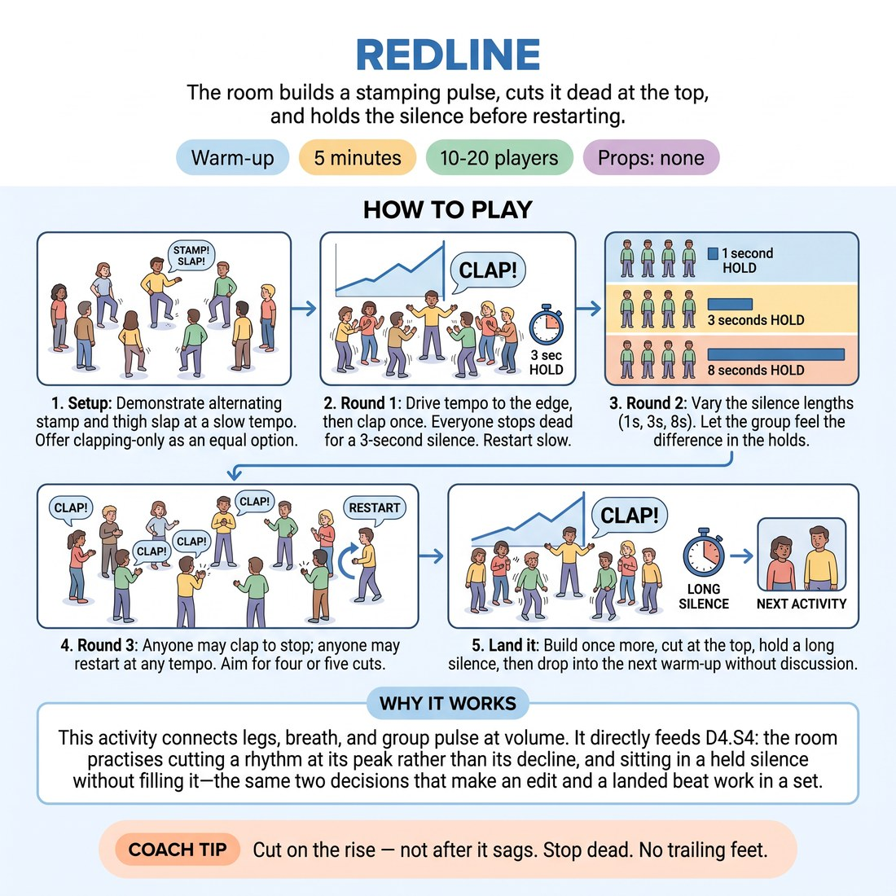

# Redline

{ .infographic }

> The room builds a stamping pulse, cuts it dead at the top, and holds the silence before restarting.

`Players 10–20` · `~5 min` · `Complexity 2/5` · `Energy high` · `Contact none` · `Props: none`

## What it warms

Legs, breath and the group pulse, at volume. It feeds D4.S4 directly: the room practises cutting a rhythm at its peak rather than its decline, and sitting in a held silence without filling it — the same two decisions that make an edit and a landed beat work in a set.

**Role in the cluster:** activation

## Setup

One circle, arm's length apart, shoes on, nothing in hands. Check the floor is safe to stamp on and warn anyone below or next door. No props.

## How to run it

1. Setup (45s). Demonstrate the engine: alternate stamps, hands slapping thighs on the same beat, whole body loose. Everyone joins at a slow walking tempo. Offer clapping-only as an equal option.
2. Round 1 (60s). Drive the tempo up by degrees until it is near the edge, then clap once. Everyone stops dead. Hold three seconds of silence. Restart slow.
3. Round 2 (75s). Same build, but vary the holds: cut and hold one second, then cut and hold eight. Name nothing. Let them feel the difference in the length.
4. Round 3 (75s). Hand the cut over. Anyone may clap to stop the room; anyone may restart it at a tempo of their choosing. Aim for four or five cuts.
5. Land it (45s). Build once more, cut at the top, hold a long silence, then drop straight into the next warm-up without discussion.

## Side-coach

- *"Cut on the rise — not after it sags."*
- *"Stop dead. No trailing feet."*
- *"Let the quiet one breathe. Don't fill it."*
- *"Restart together, not first."*

## Build it up

- Add a false cut: raise your hand as if to clap and don't. Anyone who stops has to restart the room.
- Make the restarts silent — no count-in, the group finds the new tempo by watching each other's shoulders.
- Two cutters at once, from opposite sides of the circle, each free to cut or restart. The room has to track both.

## If it stalls

- If restarts are ragged, take the restart back yourself for a round and count them in with two audible stamps.
- If nobody calls a cut in round 3, name three people who may cut and let the rest keep the engine going.

## Ask afterwards

1. Which hold felt too long while you were in it, and did it actually sound too long?
2. What told you the pulse had peaked?

## Scale

| Class size | What changes |
|---|---|
| 10–13 | One circle. Run all three rounds as written; expect six or seven cuts total. |
| 14–17 | One circle, but shorten round 2 to 60s so round 3 still gets four cuts with more people wanting a go. |
| 18–20 | Split into two facing circles, one either side of the room. Circle A runs the engine while B holds silence, then swap on your clap — four swaps in total. |

## Safety & inclusion

Stamping is hard on knees and on some floors. Say up front that slapping thighs or clapping is a full option, not a lesser one. No jumping. Keep arm's length spacing so nobody is struck by a swinging arm.

## Lineage

In the Ensemble body-percussion and shared-pulse warm-ups tradition. Body-percussion circles usually chase groove and keep going. Rewritten so the cut and the silence are the point: the tempo build exists only to give the cut something to interrupt, and holds are varied in length so the room learns what an eight-second beat actually feels like from inside it.
