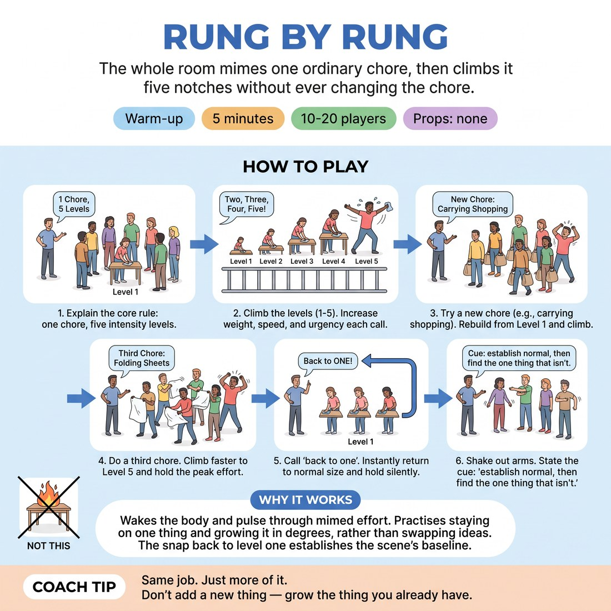

# Rung by Rung

{ .infographic }

> The whole room mimes one ordinary chore, then climbs it five notches without ever changing the chore.

`Players 10–20` · `~5 min` · `Complexity 2/5` · `Energy high` · `Contact none` · `Props: none`

## What it warms

Wakes the whole body and lifts the pulse through mimed effort and breath. Feeds Heightening & Exploration directly: the room practises staying on one thing and growing it in readable degrees, rather than swapping in a new idea whenever it gets bored. The snap back to level one gives them the ordinary baseline this week's scenes are built on.

**Role in the cluster:** activation

## Setup

Standing circle, everyone an arm's length clear on both sides. No chairs in the ring, no props. You stand inside the circle and call the numbers.

## How to run it

1. (40s) Explain: one mimed chore, five levels. One is real size. Five is as big as your body will honestly go. The chore never changes. Name the first: wiping a table.
2. (65s) Everyone wipes at level one. Call "two", "three", "four", "five" about every twelve seconds. More weight, more speed, more urgency each time. Same table, same cloth.
3. (65s) Take a chore shout from the room — carrying shopping, scraping ice, folding sheets. Rebuild at level one for fifteen seconds, then climb to five.
4. (65s) Third chore, your pick. Climb faster, roughly eight seconds a rung. Stop at five and hold it, breathing hard, for ten seconds.
5. (40s) Call "back to one". Everyone snaps to real size and keeps working. Hold silently for twenty seconds. Let them feel how small that is.
6. (25s) Shake out arms. Say the cue: establish normal, then find the one thing that isn't. Move straight on.

## Side-coach

- *"Same job. Just more of it."*
- *"Don't add a new thing — grow the thing you already have."*
- *"Three, not ten. Leave yourself somewhere to go."*
- *"Let the breath get louder as the body does."*
- *"Back to one. That's the size a scene starts at."*

## Build it up

- Drop the numbers. The room climbs together by peripheral vision alone — no calls, no leader.
- Add voice: each rung gets a breath or working sound at matching size, from a quiet sigh at one to a full grunt at five.
- Split the ladder: half the room climbs while half stays at level one, both on the same chore, both still working.

## If it stalls

- If people leap to level five in the first ten seconds, stop and rebuild level one for a full thirty seconds. The ladder only works if the bottom rung is boring.
- If the mime goes vague, switch to a chore everyone has physically done this week — bins, kettle, shoelaces — and coach weight rather than comedy.

## Ask afterwards

1. Which rung was the most interesting to watch, and why wasn't it five?
2. What did level one give you that you needed once you were at four?

## Scale

| Class size | What changes |
|---|---|
| 10–13 | One circle. Stand in the middle and call numbers at speaking volume. Three chores as written. |
| 14–17 | One wide circle. Call numbers louder and add a raised hand showing the number, so the back of the ring can see it. |
| 18–20 | Split into two half-circles facing each other across the room. Half climbs while the other half watches one full ladder, then swap. Two chores each instead of three. |

## Safety & inclusion

No contact — check everyone has an arm's length clear before you start. Level five means visible effort, not actual strain: mime the weight, don't brace or twist against it. Anyone with a sore back, knee or shoulder plays the whole ladder small or seated, and that counts as full participation.

## Lineage

In the Physical mime and effort-scaling warm-ups common in improv and movement teaching tradition. Grown from the familiar idea of playing an action at graded intensities. We fixed the chore so nothing new can be added, and closed with a snap back to level one, so the room feels the ordinary as a deliberate choice rather than a starting accident.
