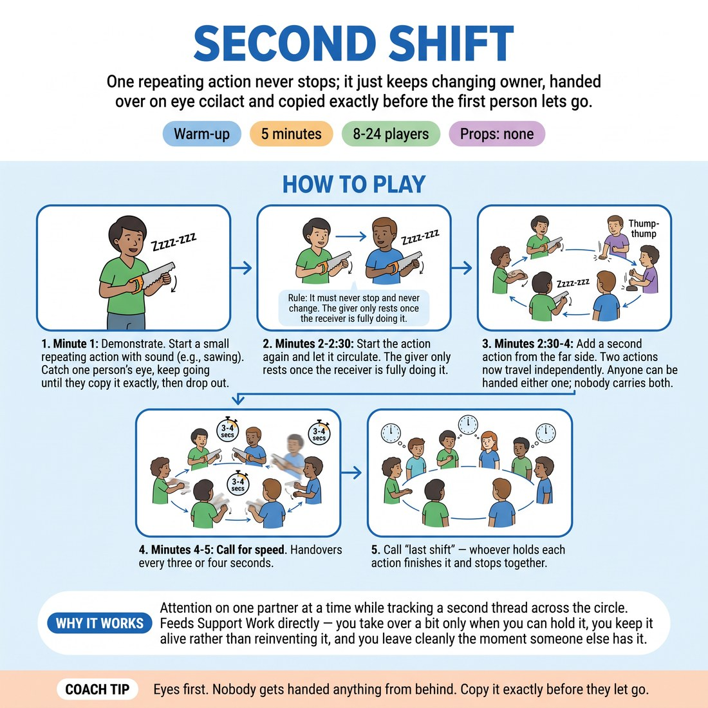

# Second Shift

{ .infographic }

> One repeating action never stops; it just keeps changing owner, handed over on eye contact and copied exactly before the first person lets go.

`Players 8–24` · `~5 min` · `Complexity 2/5` · `Energy medium` · `Contact none` · `Props: none`

## What it warms

Attention on one partner at a time while tracking a second thread across the circle. Feeds Support Work directly — you take over a bit only when you can hold it, you keep it alive rather than reinventing it, and you leave cleanly the moment someone else has it.

**Role in the cluster:** connection

## Setup

Standing circle, arm's length apart, everyone able to see every face. No props. If you have 18 or more, split into two circles at opposite ends of the room.

## How to run it

1. Minute 1: demonstrate. Start a small repeating action with a sound — sawing, stamping, stirring. Catch one person's eye, keep going until they copy it exactly, then drop out.
2. Minutes 2-2:30: start the action again and let it circulate. Rule — it must never stop and never change. The giver only rests once the receiver is fully doing it.
3. Minutes 2:30-4: add a second action from the far side of the circle. Two actions now travel independently. Anyone can be handed either one; nobody carries both.
4. Minutes 4-5: call for speed. Handovers every three or four seconds. Then call "last shift" — whoever holds each action finishes it and stops together.

## Side-coach

- *"Eyes first. Nobody gets handed anything from behind."*
- *"Copy it exactly before they let go."*
- *"Stay in it until they've got it — don't abandon."*
- *"Second action still alive? Track it without staring."*
- *"Last shift. Finish clean, both of you."*

## Build it up

- Add a sound to every action. The sound must transfer as exactly as the movement.
- Run three actions at once in a circle of twelve or more. Somebody has to notice which one is dying.
- Ban nods and names. Eye contact only, and the giver must not gesture at the receiver.

## If it stalls

- If people avoid eye contact, let them say the receiver's name as they hand over. Drop the names again after thirty seconds.
- If the action mutates into something new every pass, stop, restart with one action, and coach it as a copy job, not an invention job.
- If two actions collapse into one, that is normal. Restart the second one yourself and keep going.

## Ask afterwards

1. What did the person handing to you do that made the takeover easy?
2. When you were carrying the action, what were you doing with the rest of the room?

## Scale

| Class size | What changes |
|---|---|
| 10–13 | One circle. Both actions running from minute 2:30. Everyone should hold an action at least twice. |
| 14–17 | One circle. Keep to a single action until minute 3, then add the second — two actions in a big circle need longer to establish. |
| 18–20 | Two circles of nine or ten at opposite ends. Give each circle one action only; add a second per circle at minute 3:30 if handovers are already clean. |

## Safety & inclusion

No contact. Keep actions small and low-impact — no jumping, no swinging arms into neighbours. Anyone who wants out can accept an action and hand it straight on within two seconds; say so before you start.

## Lineage

In the Circle passing games from general theatre-games practice tradition. Standard circle games pass a pulse or a sound around a ring. Here the thing passed is an ongoing action that must survive the handover, and the giver cannot stop until the receiver has it. That turns a reflex game into a support drill.
