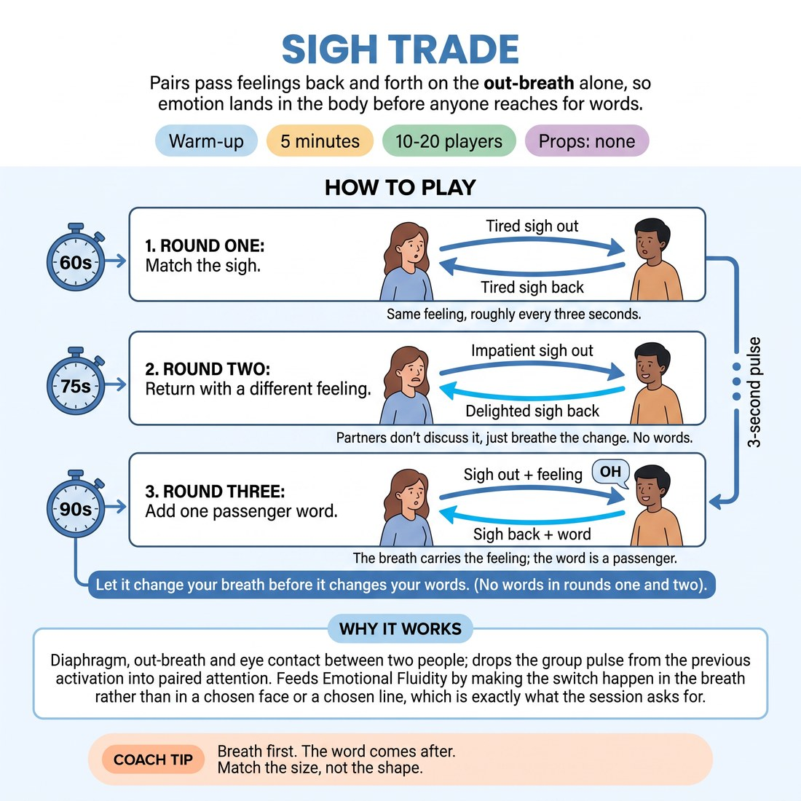

# Sigh Trade

{ .infographic }

> Pairs pass feelings back and forth on the out-breath alone, so emotion lands in the body before anyone reaches for words.

`Players 10–20` · `~5 min` · `Complexity 2/5` · `Energy medium` · `Contact none` · `Props: none`

## What it warms

Diaphragm, out-breath and eye contact between two people; drops the group pulse from the previous activation into paired attention. Feeds D1.S2 Emotional Fluidity by making the switch happen in the breath rather than in a chosen face or a chosen line, which is exactly what the session asks for.

**Role in the cluster:** connection

## Setup

Pairs standing face to face, about an arm's length apart, spread around the room. No chairs, no props. If the number is odd, make one three and have them pass in a small triangle.

## How to run it

1. 45s. Pair people up. Demo with one person: you sigh out a feeling, they take a breath and sigh it back. No words, no faces pulled for comedy — just breath.
2. 60s. Round one: partners trade sighs, matching each other. A tired sigh comes back tired. Roughly one exchange every three seconds. Keep eye contact if it's comfortable.
3. 75s. Round two: return the sigh with a different feeling. Impatient goes out, delighted comes back. Partners don't discuss it, they just breathe the change.
4. 90s. Round three: add one word on top of the out-breath. Any word — 'right', 'oh', a name. The breath carries the feeling; the word is a passenger.
5. 30s. Stop. Hands down, one normal breath together. Ask two pairs what they caught that they didn't intend to send. Move on.

## Side-coach

- *"Breath first. The word comes after."*
- *"Match the size, not the shape."*
- *"Let the out-breath do the work — don't act the face."*
- *"Don't decide the feeling. Notice what came out."*
- *"Slow down. One exchange every three seconds."*

## Build it up

- Call a named emotion to the whole room mid-round; every pair must arrive at it within two exchanges.
- Ban matching entirely — every returned sigh must be a different feeling from the one received.
- Let the word grow to a short phrase, but the feeling must still be readable with the words muted.

## If it stalls

- If pairs go silly and start honking, stop them and run ten seconds of plain sighing with no feeling at all, then restart round two.
- If people can't find a second feeling, call one out loud for the whole room — 'relieved' — and let every pair use it at once.

## Ask afterwards

1. Did the feeling arrive in your breath before you knew what it was?
2. What was harder: sending a feeling, or letting your partner's change yours?

## Scale

| Class size | What changes |
|---|---|
| 10–13 | Run as written, then swap partners for a 30-second bonus of round two by shortening the close to 15 seconds. |
| 14–17 | Run exactly as written. Make one three if the number is odd; they pass round the triangle rather than back and forth. |
| 18–20 | Set pairs in two facing ranks so you can see every face from one spot. Cut round three to 60 seconds and the close to 15 seconds to hold five minutes. |

## Safety & inclusion

Sustained eye contact is optional — offer looking at a partner's forehead or hands instead. Keep breathing normal in depth; no forcing, no fast repeated deep breaths. Anyone feeling light-headed sits out and watches. No contact at any point.

## Lineage

In the Mirror and emotional-echo work from actor training, reduced to breath tradition. Standard mirroring drills copy movement. This version strips out the movement entirely and passes only the out-breath, because the session's point is that feeling reaches the body before the vocabulary. The single added word in round three is our own, to build the bridge to spoken scenes.
