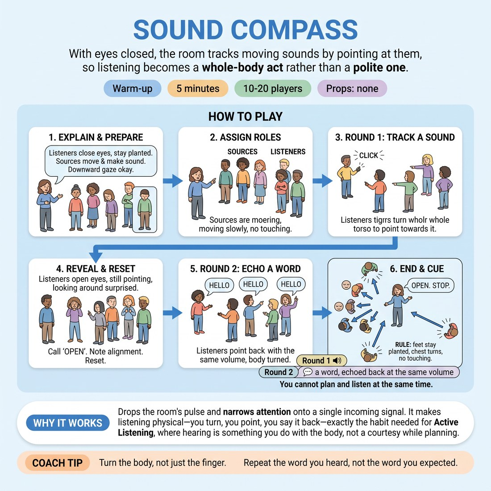

# Sound Compass

{ .infographic }

> With eyes closed, the room tracks moving sounds by pointing at them, so listening becomes a whole-body act rather than a polite one.

`Players 10–20` · `~5 min` · `Complexity 2/5` · `Energy low` · `Contact none` · `Props: none`

## What it warms

Drops the room's pulse after the loud warm-ups and narrows attention onto a single incoming signal. It makes listening physical — you turn towards it, you point at it, you say it back — which is exactly the habit needed for Active Listening in scenes, where hearing is something you do with the body, not a courtesy you pay while planning.

**Role in the cluster:** focus

## Setup

Clear the floor. Spread everyone out standing, at least an arm's length from anyone else, facing any direction. No props, no chairs in the walking lanes.

## How to run it

1. (45s) Explain: listeners close their eyes and stay planted; sources move and make sound. Anyone who dislikes closed eyes may drop their gaze to the floor instead. Ask for quiet.
2. (30s) Name three people aloud as sources. Everyone else closes eyes. Sources keep eyes open, walk slowly, and never touch anyone.
3. (60s) Sources make one small repeating sound — a click, a tap, a low hum — every few seconds, moving two slow steps between sounds. Listeners point their whole torso at each sound.
4. (15s) Call 'open'. Listeners keep pointing and look. Note the misses without comment. Reset.
5. (110s) Round two: sources now say a single ordinary word instead of a sound. Listeners point and repeat the word back out loud at the same volume they heard it.
6. (40s) Call 'open' and stop. Say the cue: you cannot plan and listen at the same time. Move straight on.

## Side-coach

- *"Turn the body, not just the finger."*
- *"Repeat the word you heard, not the word you expected."*
- *"Sources, quieter. Make them work."*
- *"Feet planted. Nobody walks with their eyes shut."*
- *"If you lose it, wait. The next sound is coming."*

## Build it up

- Sources stop repeating: each says its word once only. Listeners must point and repeat from a single hearing.
- Two sources speak at the same moment. Listeners point one arm at each and repeat both words in the order they landed.
- Sources speak in a whisper and keep moving while they speak, so the sound arrives from a place they have already left.

## If it stalls

- If the room is echoey and everyone points wildly, drop to two sources and ask them to move less. Accuracy is not the point; the reaching is.
- If listeners peek or giggle, stop, name it plainly, and run twenty seconds of silence before restarting.

## Ask afterwards

1. What happened in your head between hearing a word and repeating it?
2. Which was harder to track: the sounds or the words, and why?

## Scale

| Class size | What changes |
|---|---|
| 10–13 | Two sources in round one, three in round two. Run both rounds as written. |
| 14–17 | Three sources in round one, four in round two. Spread the group wider so sounds don't overlap. |
| 18–20 | Four sources in round one. For round two, swap: the four sources become listeners and pick five new sources from those who have not yet moved. Trim step three to 45 seconds to hold the five minutes. |

## Safety & inclusion

Listeners keep both feet planted and eyes closed only if they choose; a lowered gaze works just as well. Sources walk slowly with eyes open and give everyone a wide berth. No contact at any point. Anyone who finds closed eyes unpleasant can sit this out at the edge and watch.

## Lineage

In the Ensemble sensory-awareness and blind-tracking work used in actor training tradition. Blind sound-tracking drills are old and widespread in movement training. Written from scratch here, with moving sources and spoken words added in round two so the exercise lands on verbal listening rather than general sensory alertness, and with the blindfold replaced by a consent-friendly closed-eyes-or-lowered-gaze choice.
