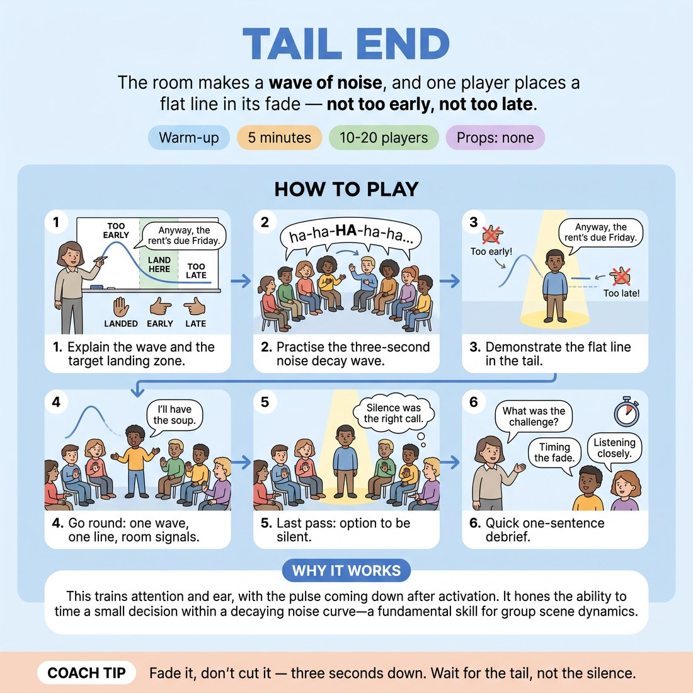

# Tail End

{ .infographic }

> The room makes a wave of noise, and one player places a flat line in its fade — not too early, not too late.

`Players 10–20` · `~5 min` · `Complexity 3/5` · `Energy low` · `Contact none` · `Props: none`

## What it warms

Attention and ear, with the pulse coming down after the earlier activation. Trains the decay curve of a room's noise and the small decision at the bottom of it — feeds D5.S2 directly, since the wave gives information and the speaker still chooses the beat.

**Role in the cluster:** focus

## Setup

Chairs in a horseshoe, everyone seated, facing the open end. No props. You stand at the open end and conduct the wave with one hand.

## How to run it

1. (45s) Explain: the room builds a wave of sound and lets it fade. One player places a single flat, boring line in the fade — before silence, after the peak.
2. (30s) Practise the wave only. Hand rises, everyone builds a 'ha-ha' rumble; hand drops, let it decay over about three seconds. No cutting off.
3. (30s) Demonstrate. Run one wave and drop a line into the tail: 'Anyway, the rent's due Friday.' Show one that's too early and one that's too late.
4. (2m) Round the horseshoe. Each player gets one wave and one line. Room signals after each: flat palm on it, thumb forward early, thumb back late.
5. (45s) Last pass: the speaker may choose to say nothing and let the wave die out. Room signals whether the silence was the right call.
6. (30s) One debrief question, answers in a sentence each. Stop on time.

## Side-coach

- *"Fade it, don't cut it — three seconds down."*
- *"Wait for the tail, not the silence."*
- *"Flat line. No jokes in there."*
- *"Their noise is information. Your timing is your choice."*
- *"Meet the wave coming down; don't chase it."*

## Build it up

- Vary the wave: sometimes a tiny ripple, sometimes a long roll. The speaker scales the line's size to what the room actually gave.
- Two speakers per wave. They must not collide, and neither may signal to the other.
- The room may fake a second swell as the first fades. Speaker decides whether to ride it or ignore it.

## If it stalls

- Waves collapse instantly: conduct the decay with your hand and count three out loud until the room hears the curve.
- People try to be funny in the gap: hand out the lines yourself — 'the bins go out Tuesday' — so only the timing is being judged.
- Signals get vague: insist on the three hand shapes, no talking, and move straight to the next player.

## Ask afterwards

1. What told you the wave was on its way down?
2. When you went early, what were you reacting to — the room, or your own nerves?

## Scale

| Class size | What changes |
|---|---|
| 10–13 | One horseshoe. Everyone gets a turn with two spare waves left over for a re-try. |
| 14–17 | One horseshoe. Skip the practice wave and keep the pass brisk; if you run short, mark where you stopped and start there next time. |
| 18–20 | Split into two horseshoes of nine or ten in opposite corners. Appoint a wave-leader in each. Run in parallel; you float between them. |

## Safety & inclusion

Keep the wave at conversational volume — no shrieking or sustained shouting. Anyone sensitive to noise can sit at the end of the horseshoe and take part by signalling only.

## Lineage

In the Comedy timing coaching on riding and cushioning a laugh tradition. The standard version needs a real audience laughing. We built a synthetic wave the room controls, added hand signals so feedback is instant and silent, and made the line deliberately dull so timing is the only thing being scored.
