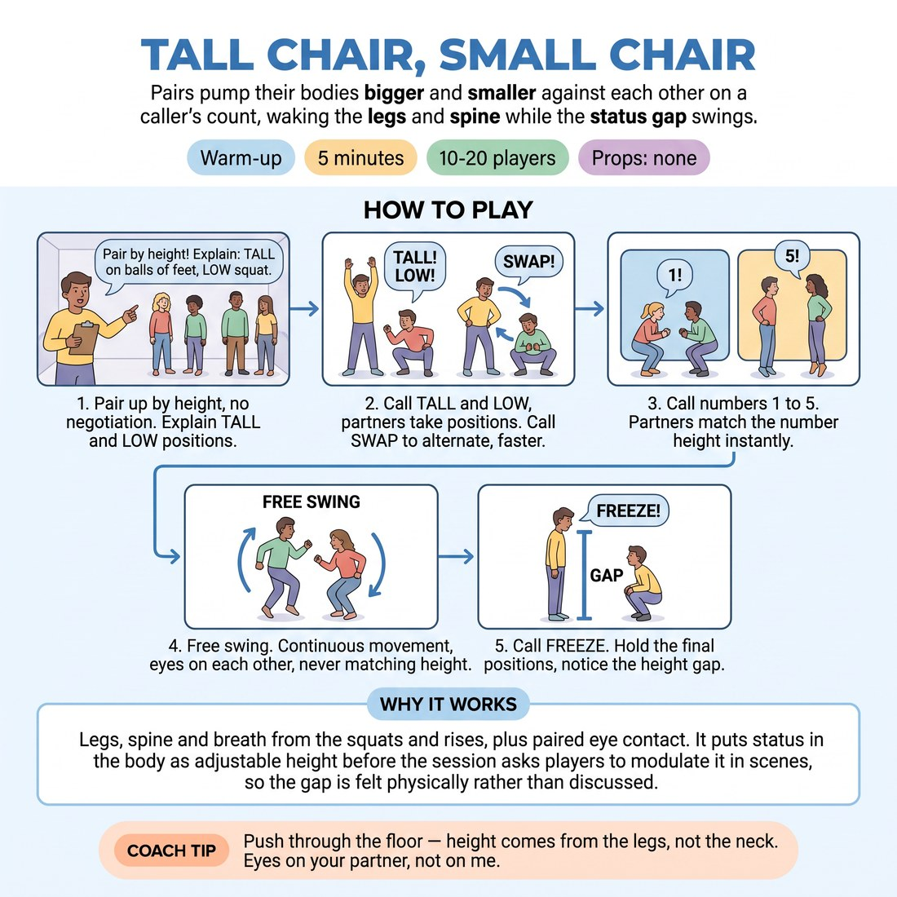

# Tall Chair, Small Chair

{ .infographic }

> Pairs pump their bodies bigger and smaller against each other on a caller's count, waking the legs and spine while the status gap swings.

`Players 10–20` · `~5 min` · `Complexity 2/5` · `Energy high` · `Contact none` · `Props: none`

## What it warms

Legs, spine and breath from the squats and rises, plus paired eye contact. It puts status in the body as adjustable height before the session asks players to modulate it in scenes, so the gap is felt physically rather than discussed.

**Role in the cluster:** activation

## Setup

Clear floor. Pairs stand facing each other, arm's length apart, spread around the room. No chairs despite the name — the body makes the height.

## How to run it

1. 30s: Pair people up by height-neighbour, no negotiation. Explain: on your call, one grows tall on the balls of the feet, the other sinks into a low squat.
2. 60s: Call TALL and LOW. A grows, B sinks. Hold three seconds. Call SWAP. Repeat five or six times, faster each time. Legs should burn a little.
3. 90s: Now call a number 1 to 5. Both partners take that height at once — 1 is floor-low, 5 is stretched tall. Call numbers quickly. Pairs match without discussing.
4. 90s: Free swing. No caller. Each pair moves continuously between high and low, never both the same height for more than a beat. Eyes on each other throughout.
5. 30s: Call FREEZE. Both partners hold whatever height they landed in. Look at the gap between you. Shake out.

## Side-coach

- *"Push through the floor — height comes from the legs, not the neck."*
- *"Eyes on your partner, not on me."*
- *"Play the gap, not the person."*
- *"Someone move first — do not both wait."*

## Build it up

- Add a sound: high position gets a thin high hum, low gets a low rumble. Pitch follows the body.
- Ban the extremes — pairs must play only between 2 and 4, making the gap smaller and harder to read.
- Rotate partners twice during the free swing so players meet a new height range without stopping.

## If it stalls

- If pairs mirror each other into a stalemate, name one partner in each pair as the mover for ten seconds and the other as the responder.
- If the squats look painful, cap the low at a bent-knee lean and say so out loud.

## Ask afterwards

1. When you were the one who moved, what did your partner do about it?
2. Which height cost you more effort — and did that change how you looked at them?

## Scale

| Class size | What changes |
|---|---|
| 10–13 | One caller, everyone pairs. Five or six TALL/LOW swaps in step 2. |
| 14–17 | Same pairs shape. Give the number calls faster in step 3 — eight or nine numbers instead of six — to keep the room from drifting. |
| 18–20 | With an odd or crowded room, run a few trios: two move, one holds a middle height as reference. Rotate the middle person once during step 4. |

## Safety & inclusion

No contact at any point. Squats are optional depth — a half-bend counts as low. Anyone with knee, back or balance concerns plays the whole thing with hands and spine only, standing. Say this before step 1.

## Lineage

In the Status work from British improvisation teaching, where status is drilled as adjustable physical level rather than character type. tradition. Common status-level exercises are usually walked around a room. This version is fixed in place and paired, so it works as a leg-and-lung activation without repeating the walking shape used elsewhere in the cluster.
