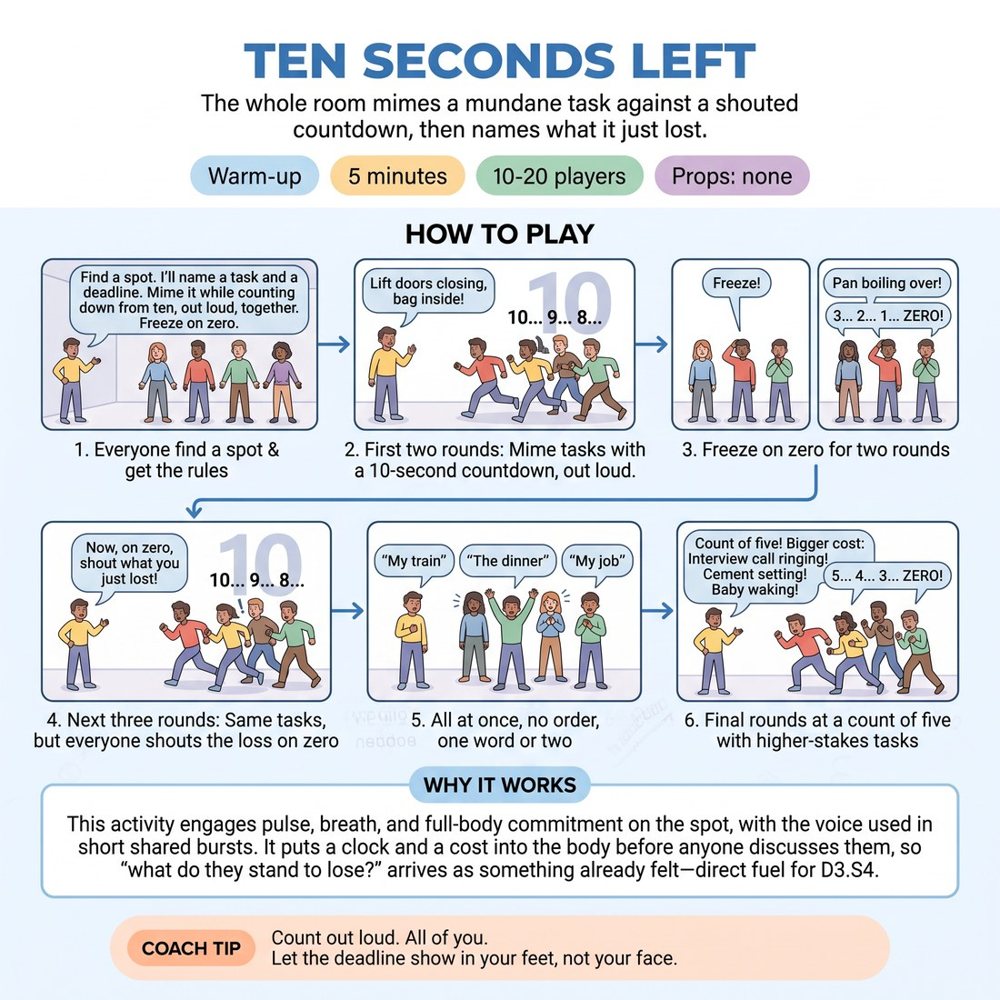

# Ten Seconds Left

{ .infographic }

> The whole room mimes a mundane task against a shouted countdown, then names what it just lost.

`Players 10–20` · `~5 min` · `Complexity 2/5` · `Energy high` · `Contact none` · `Props: none`

## What it warms

Pulse, breath and full-body commitment on the spot, with the voice used in short shared bursts. It puts a clock and a cost into the body before anyone discusses them, so "what do they stand to lose?" arrives as something already felt — direct fuel for D3.S4.

**Role in the cluster:** activation

## Setup

Everyone stands on their own spot with an arm's span clear on all sides. No props, no chairs in the way. You call the tasks and lead the count.

## How to run it

1. (30s) Everyone find a spot. Explain: you name a task and a deadline. The room mimes it flat out while counting down from ten, out loud, together. Freeze on zero.
2. (60s) Two rounds. "The lift doors are closing and your bag is inside." Count ten to zero with them. Freeze. Then: "The pan is boiling over." Count. Freeze.
3. (90s) Three rounds. Same shape, but on zero everyone shouts one thing they just lost — "my train", "the dinner", "my job". One word or two. All at once, no order.
4. (90s) Three rounds at a count of five. Tasks with a bigger cost: the interview call is ringing, the cement is setting, the baby is waking. Shout the loss on zero.
5. (30s) Shake the arms out. One line: the count is not the point — what the count costs you is.

## Side-coach

- *"Count out loud. All of you."*
- *"Let the deadline show in your feet, not your face."*
- *"Zero. Freeze. What did you just lose?"*
- *"Faster hands, lower centre."*
- *"Half the count this time — five, four..."*

## Build it up

- Cut the count to five, then to three. Same task, same completion required.
- Take one resource away mid-round: no hands, or one foot glued to the floor. They still have to finish.
- Stack two deadlines at once — the lift is closing and the phone is ringing — and make them choose which they lose.

## If it stalls

- If the miming stays small and polite, add a physical obstacle: the drawer is jammed, the lid is on too tight, the floor is wet.
- If the counting goes quiet, count with them at full volume and drop out on the last three so they carry it.
- If people freeze late, call "zero" hard and hold the silence for two seconds before the next task.

## Ask afterwards

1. Which round had the most urgency in your body, and what made it that one?
2. When you shouted what you lost, did the miming change afterwards?

## Scale

| Class size | What changes |
|---|---|
| 10–13 | Eight rounds, everyone playing together, you call every task. |
| 14–17 | Seven rounds. You call the first five; invite two participants to call the last two tasks and lead the count. |
| 18–20 | Split into two halves facing each other across the room. Halves alternate rounds, three each. The watching half shouts the countdown for the working half. |

## Safety & inclusion

No contact at any point — everyone stays on their own spot with an arm's span clear. Full-speed mime only; no running, jumping or dropping to the floor. Anyone with knees, back or breathing to protect plays at half speed or does the task seated, and still counts. Volume is shared, so nobody shouts solo.

## Lineage

Originally authored. Timed mime drills are common in physical warm-ups; the addition here is the shouted loss on zero, which ties the urgency to the week's cue rather than leaving it as a speed game.
