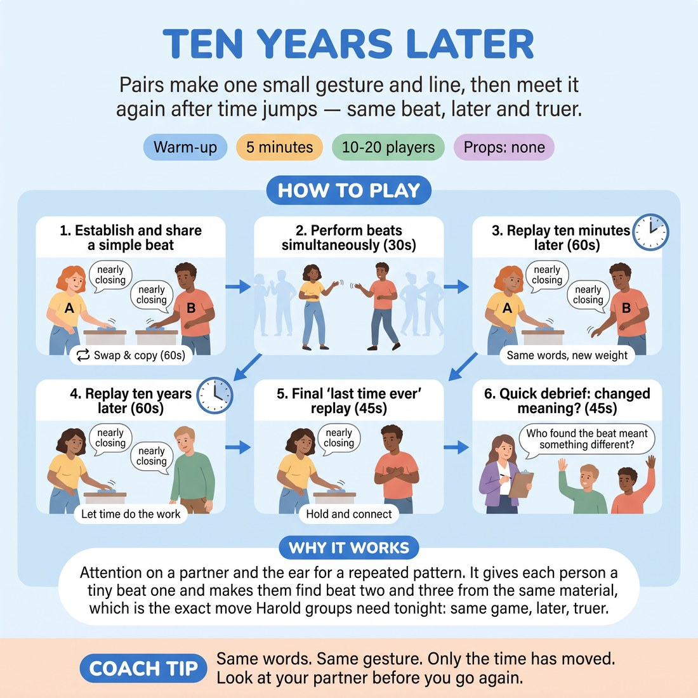

# Ten Years Later

{ .infographic }

> Pairs make one small gesture and line, then meet it again after time jumps — same beat, later and truer.

`Players 10–20` · `~5 min` · `Complexity 3/5` · `Energy medium` · `Contact none` · `Props: none`

## What it warms

Attention on a partner and the ear for a repeated pattern. It gives each person a tiny beat one and makes them find beat two and three from the same material, which is the exact move Harold groups need tonight: same game, later, truer.

**Role in the cluster:** connection

## Setup

Pairs standing face to face, an arm's length apart, spread round the room. No chairs, no props. Odd number: make one trio and the third person echoes both.

## How to run it

1. Pair up. A makes one small gesture with one short line — something ordinary, like wiping a counter and saying 'nearly closing'. B copies it back exactly. Swap. (60 seconds)
2. Both partners now hold their own gesture and line as their beat. Say it once each, together in the room, at the same time as everyone else. (30 seconds)
3. Call 'ten minutes later'. Each partner replays their own beat, changed by ten minutes only. Same gesture, same words, new weight. Watch your partner between goes. (60 seconds)
4. Call 'ten years later'. Replay again. Still the same gesture and the same words. Let the years do the work, not volume. (60 seconds)
5. Call 'last time ever'. One final replay each, then hold still and look at your partner. (45 seconds)
6. Take hands up: who found their partner's beat meant something different by the end? Two answers, no discussion. (45 seconds)

## Side-coach

- *"Same words. Same gesture. Only the time has moved."*
- *"Look at your partner before you go again."*
- *"Don't get bigger. Get later."*
- *"Let the line cost you something now."*
- *"Hold the last one. Don't rescue it."*

## Build it up

- Take the words away. Third return is gesture only, and the partner has to read what changed.
- Swap beats: on the last return, each partner performs the other's beat as it would be years on.
- Call the time jumps out of order — 'one hour later', 'thirty years later', 'the next morning' — so nobody can plan an arc.

## If it stalls

- This one often tips into silly voices and cartoon ageing. Stop the room, name it, and run 'ten minutes later' again with the instruction: change nothing but what you know.
- If a pair has picked something too grand to repeat, tell them to swap it for something they could do in a kitchen.

## Ask afterwards

1. What did the third return give you that the first one couldn't?
2. When your partner repeated their beat, what did you start listening for?

## Scale

| Class size | What changes |
|---|---|
| 10–13 | Five or six pairs. Run all three time jumps and take three answers at the end. |
| 14–17 | Seven or eight pairs. Run all three time jumps but cut the final share to two answers; keep the room moving together. |
| 18–20 | Ten pairs. Drop 'ten minutes later' and run only 'ten years later' and 'last time ever', giving each 75 seconds. Take one answer at the end. |

## Safety & inclusion

No contact — gestures stay inside your own arm's length. Anyone who prefers not to face a partner directly can stand shoulder to shoulder and work side by side. Keep lines mundane; nobody is asked to disclose anything real.

## Lineage

In the Long-form beat structure as taught in North American Harold training tradition. Harold beat work usually returns a group scene later in a set. We shrank it to one gesture and one line per person so a proficient room can feel the mechanic of the return in two minutes, and we replaced 'heighten' with 'move the clock' because rooms default to louder rather than later.
