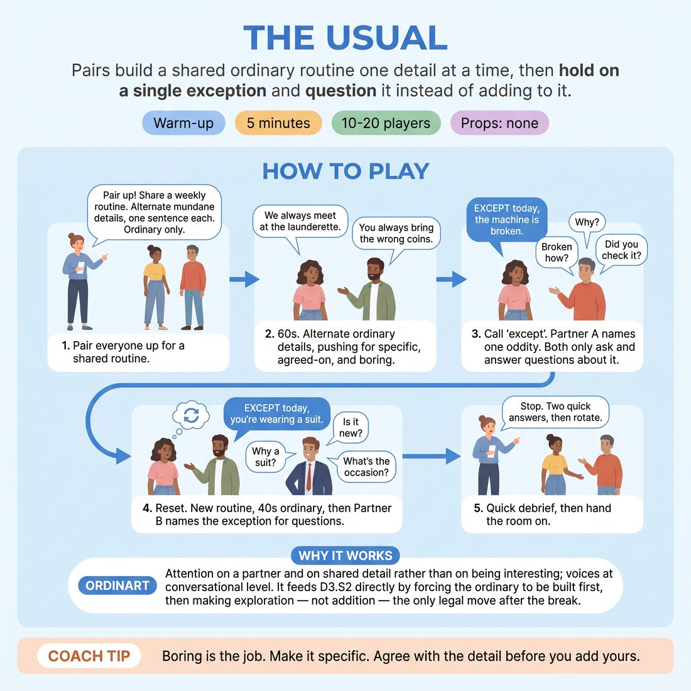

# The Usual

{ .infographic }

> Pairs build a shared ordinary routine one detail at a time, then hold on a single exception and question it instead of adding to it.

`Players 10–20` · `~5 min` · `Complexity 2/5` · `Energy medium` · `Contact none` · `Props: none`

## What it warms

Attention on a partner and on shared detail rather than on being interesting; voices at conversational level. It feeds D3.S2 directly by forcing the ordinary to be built first, then making exploration — not addition — the only legal move after the break.

**Role in the cluster:** connection

## Setup

Pairs standing or sitting face to face, wherever they are in the room. No props, no walking about. If numbers are odd, make one trio that rotates in the same order each time.

## How to run it

1. 45s. Pair everyone up. Tell them: you two share a weekly routine. Alternate single mundane details, one sentence each. Nothing strange. Ordinary only.
2. 60s. Go. "We always meet at the launderette." "You always bring the wrong coins." Keep swapping. Push for boring, specific, agreed-on.
3. 60s. Call "except". Partner A names one thing that is not normal today, in one sentence. From then on, both may only ask and answer questions about that one thing. No new oddities.
4. 90s. Reset with the same partner. New routine, 40 seconds of ordinary, then Partner B names the exception and both question it for the rest.
5. 45s. Stop. Take two quick answers to a debrief question, then hand the room on.

## Side-coach

- *"Boring is the job. Make it specific."*
- *"Agree with the detail before you add yours."*
- *"Only one thing is odd. Everything else still holds."*
- *"Ask about it. Don't top it."*
- *"Where was it before? Who else knows?"*

## Build it up

- After the exception is named, ban questions starting with "why". They must find out through concrete detail instead.
- Require that every answer in the exploring phase reincorporates one item from the ordinary phase.
- Third round: neither partner announces the exception. One of them simply plays it, and the other has to notice and start asking.

## If it stalls

- If pairs go strange in the ordinary phase, stop them and give the routine yourself: a Tuesday bus stop, a shared kitchen, a dog walk. Restart from there.
- If the questioning phase dries up after three exchanges, call out one question type — "how long has it been like that?" — and let them keep going.
- If a pair adds a second oddity, name it lightly and tell them to fold it into the first.

## Ask afterwards

1. Which detail from the ordinary phase made the exception land hardest?
2. What did you learn about the odd thing that you could only learn by staying with it?

## Scale

| Class size | What changes |
|---|---|
| 10–13 | Five to six pairs, plus one trio if odd. Run both rounds as written with the same partner. |
| 14–17 | Seven to eight pairs. Cut the second round's ordinary phase to 30 seconds so the timing holds. |
| 18–20 | Nine to ten pairs. Volume gets loud, so call "except" with a clap rather than your voice, and keep both rounds with the same partner to avoid a re-pairing scramble. |

## Safety & inclusion

No contact. Detail comes from an invented shared routine, not from anyone's real life; tell people they can invent freely and need not disclose anything true. Anyone who wants out can observe a pair and report one detail back.

## Lineage

In the Johnstone-lineage work on routines and the break in the routine. tradition. Source: *Impro (1979)*. Johnstone's point is that a break only reads once a routine exists. We turned that into a timed two-phase pair drill and added the hard rule that after the break you may only ask questions — no second oddity — so the room practises exploring rather than piling on.
