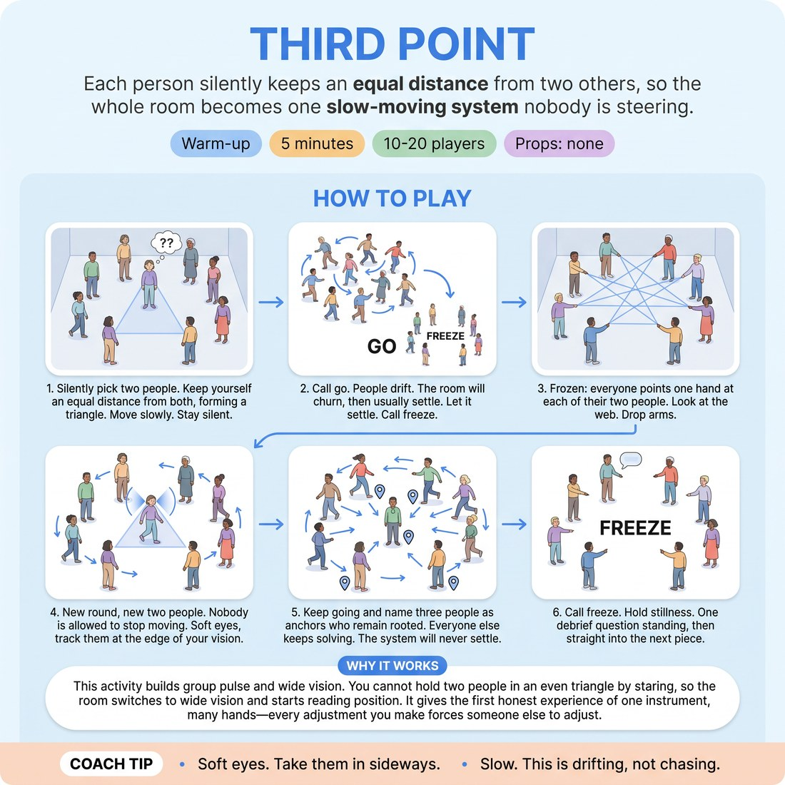

# Third Point

{ .infographic }

> Each person silently keeps an equal distance from two others, so the whole room becomes one slow-moving system nobody is steering.

`Players 10–20` · `~5 min` · `Complexity 2/5` · `Energy low` · `Contact incidental` · `Props: none`

## What it warms

Attention and group pulse, with just enough movement to keep bodies awake after the blast. Feeds D4.S1 directly: you cannot hold two people in an even triangle by staring at them, so the room switches to wide vision and starts reading position instead of faces. It also gives the first honest experience of the session essence — one instrument, many hands — because every adjustment you make forces someone else to adjust.

**Role in the cluster:** connection

## Setup

Clear the floor and scatter everyone at random, arm's length apart, facing no particular direction. Bags and chairs to the walls. No circle — break it if one forms.

## How to run it

1. (45s) Everyone silently picks two people. Tell no one. Your job: keep yourself the same distance from both, so the three of you make an even triangle. Move slowly. Stay silent.
2. (60s) Call go. People drift. The room will churn, then usually settle. Let it settle. Call freeze the moment it stops moving.
3. (45s) Frozen: everyone points one hand at each of their two people. Look at the web. Let people see who was holding whom. Drop arms.
4. (75s) New round, new two people, and this time nobody is allowed to stop moving. Soft eyes, no staring, no head-swivelling. Track them at the edge of your vision.
5. (45s) Keep going and name three people as anchors — they root to the spot. Everyone else keeps solving. The system will never settle now.
6. (30s) Call freeze. Hold ten seconds of stillness. One debrief question standing where they are, then straight into the next piece.

## Side-coach

- *"Soft eyes. Take them in sideways."*
- *"Slow. This is drifting, not chasing."*
- *"You are also someone else's point. Move for them too."*
- *"Silent. Solve it with your feet."*
- *"Feel the whole room, not just your two."*

## Build it up

- Add anchors: name three people who freeze in place, so the triangles can never resolve.
- Ban head movement entirely — nose forward, solve it with peripheral vision only.
- Each person picks three people instead of two and keeps equal distance from all three; expect it to fail, and let the failing be the point.

## If it stalls

- If it settles in five seconds, the room is too spread out — shrink the playing area by half and rerun.
- If people lock their heads onto their two, stop and rerun with one rule: your nose points forward the whole round.
- If nobody moves at all, tell three people to take four steps in any direction and watch the room re-solve.

## Ask afterwards

1. Did you keep tracking your two once you stopped looking straight at them?
2. What did you notice about the room as a whole, not just your triangle?
3. Who moved for you without you asking?

## Scale

| Class size | What changes |
|---|---|
| 10–13 | One group on the whole floor. Run all three rounds as written; add a fourth 30-second round where everyone picks two new people mid-motion without stopping. |
| 14–17 | One group, but mark a tighter box with chairs — roughly four paces per person. Density does the work. Cut the anchor round to 30 seconds if the floor gets crowded. |
| 18–20 | Split into two halves, each using one end of the room. Half A plays rounds one and two while half B watches from the wall; swap for the anchor round. Ask watchers to name one person who never turned their head. |

## Safety & inclusion

People move while looking sideways, so collisions happen. Set a hard rule: walking pace maximum, no reversing at speed, hands loose at your sides. Incidental brushing is likely — say so up front and tell anyone who would rather not be touched to play from the edge of the space as an anchor for the whole exercise. Anyone with limited mobility can stand as a permanent anchor and still be chosen as a point.

## Lineage

In the Theatre of the Oppressed space-and-perception games tradition. Source: *Games for Actors and Non-Actors (1992)*. The equal-distance-from-two-people idea comes from Boal's floor exercises for group perception. Rewritten from scratch for a 5-minute improv slot: silence and soft eyes are now rules rather than options, the frozen point-at-your-two check is added so the group sees the web it built, and the anchors round is added to stop the system resolving. Boal used these to sensitise a group to space; here they feed peripheral tracking of a stage picture.
