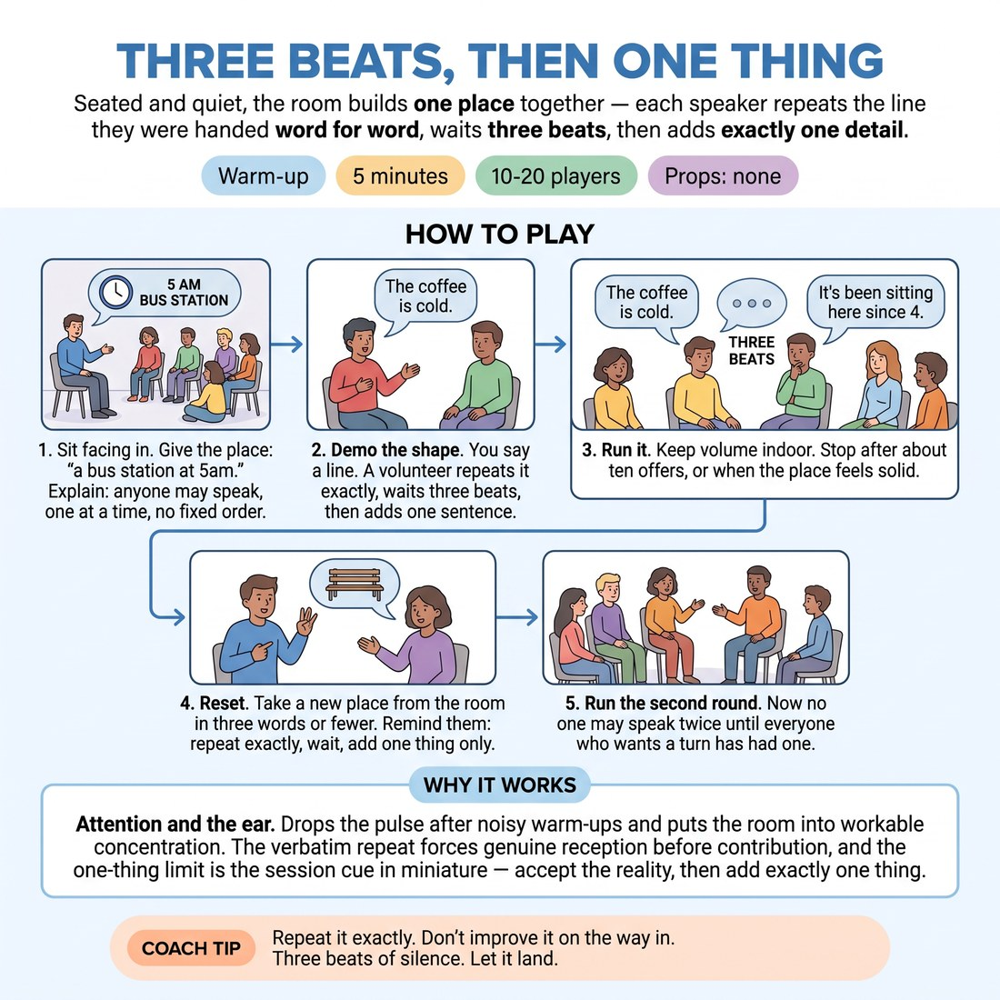

# Three Beats, Then One Thing

{ .infographic }

> Seated and quiet, the room builds one place together — each speaker repeats the line they were handed word for word, waits three beats, then adds exactly one detail.

`Players 10–20` · `~5 min` · `Complexity 2/5` · `Energy low` · `Contact none` · `Props: none`

## What it warms

Attention and the ear. Drops the pulse after the noisy warm-ups and puts the room into workable concentration. The verbatim repeat forces genuine reception before contribution, and the one-thing limit is the session cue in miniature — accept the reality, then add exactly one thing.

**Role in the cluster:** focus

## Setup

Everyone sits on the floor or on chairs in a loose scatter facing the centre — no rows, no fixed order. Nobody stands. No props.

## How to run it

1. (45s) Sit the room down facing in. Give the place: 'a bus station at 5am.' Explain: anyone may speak, one at a time, no going round.
2. (45s) Demo the shape yourself with one volunteer. You say a line. They repeat your line word for word, wait three silent beats, then add one sentence of their own.
3. (90s) Run it. Keep the volume at indoor level. Stop the round after about ten offers, or when the place feels solid.
4. (30s) Reset. Take a new place from the room in three words or fewer. Remind them: repeat exactly, wait, add one thing only.
5. (90s) Run the second round. Now no one may speak twice until everyone who wants a turn has had one.

## Side-coach

- *"Repeat it exactly. Don't improve it on the way in."*
- *"Three beats of silence. Let it land."*
- *"One thing. Not two."*
- *"Add a detail, not a plot twist."*
- *"Anyone can go. Nobody has to."*

## Build it up

- Drop the volume to just-audible so people must lean in to receive the line at all.
- Require that the added detail contradicts nothing already said — if it does, the room says 'again' and the speaker reworks it.
- Ban visual detail. Additions must be sound, smell, temperature or texture only.

## If it stalls

- If two people start at once, let them sort it in silence — do not appoint an order. That negotiation is the focus work.
- If the additions get big and eventful, stop and hand them a smaller frame: 'add something you can see, hear or smell.'
- If the room goes silent for long, don't rescue it. Count to five, then offer one line yourself and hand it back.

## Ask afterwards

1. What changed in your listening when you knew you'd have to say the line back word for word?
2. Was the three-beat wait comfortable or did you want to fill it?

## Scale

| Class size | What changes |
|---|---|
| 10–13 | One group, two rounds of roughly ten offers each. Everyone will get a turn without being asked to. |
| 14–17 | One group. In round two, hold the rule that nobody speaks a second time until every willing person has spoken once — expect a few passes, that's fine. |
| 18–20 | Split into two seated clusters in opposite corners. Give each the same place. Run both rounds simultaneously; you circulate. Take thirty seconds at the end to hear one line from each cluster. |

## Safety & inclusion

Floor sitting is optional — keep chairs available and say so. No contact. Passing is always allowed; anyone may sit the whole thing out and just listen.

## Lineage

In the Group circle-storytelling and last-word listening drills common in improv training tradition. The familiar version passes a story round a circle in order. We removed the order, made the repeat verbatim, and inserted a mandatory three-beat pause so the exercise trains reception and stillness rather than speed and invention.
