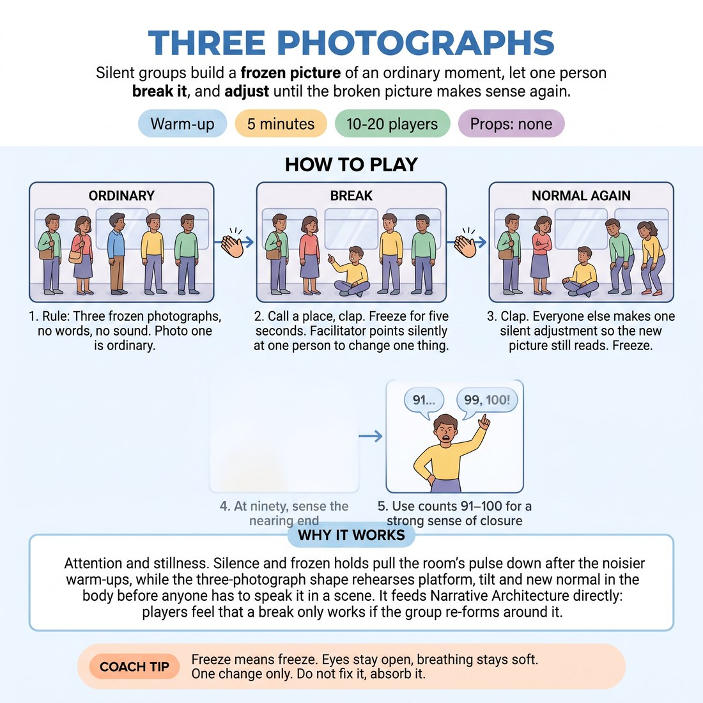

# Three Photographs

{ .infographic }

> Silent groups build a frozen picture of an ordinary moment, let one person break it, and adjust until the broken picture makes sense again.

`Players 10–20` · `~5 min` · `Complexity 3/5` · `Energy low` · `Contact none` · `Props: none`

## What it warms

Attention and stillness. Silence and frozen holds pull the room's pulse down after the noisier warm-ups, while the three-photograph shape rehearses platform, tilt and new normal in the body before anyone has to speak it in a scene. It feeds Narrative Architecture directly: players feel that a break only works if the group re-forms around it.

**Role in the cluster:** focus

## Setup

Clear a space so each group has a few square metres. Groups of four or five, standing loosely in their own patch, facing inwards. No talking once the round starts; you run the whole thing on claps and pointing.

## How to run it

1. (45s) Groups of four or five. Rule: three frozen photographs, no words, no sound. Photo one is ordinary. Photo two breaks it. Photo three makes the break normal again.
2. (90s) Round one. Call a place: 'a bus queue'. Clap. Groups have five seconds to freeze into an ordinary picture of it. Hold ten seconds while you point silently at one person per group.
3. (90s) Clap. The person you pointed at changes one thing — position, level, direction. Everyone else makes one silent adjustment so the new picture still reads. Clap. Freeze the settled version. Hold ten. Relax.
4. (75s) Round two, same three claps, new place: 'a waiting room'. This time point at someone within two seconds so the break lands early. Hold the last photograph ten seconds, then stop.

## Side-coach

- *"Freeze means freeze. Eyes stay open, breathing stays soft."*
- *"One change only. Do not fix it, absorb it."*
- *"Watch the whole group with your edges, not by turning your head."*
- *"Photograph three is the new ordinary. Make it look lived in."*
- *"Silence all the way through. No sound effects."*

## Build it up

- Point at two people per group instead of one. Two simultaneous breaks, still only one adjustment each.
- Add a fourth photograph: after the new normal, the group finds an image showing what this costs someone.
- Remove your claps. One group member starts a slow count on their fingers and the group runs the three photographs off that alone.

## If it stalls

- If groups mill about instead of freezing, cut the forming time to three seconds. Speed removes the negotiating.
- If the break gets huge and cartoonish, name it: the change should be small enough that adjusting is possible. Repeat the round.
- If nobody adjusts and the picture just sits broken, call one extra clap and say 'one move each, now'.

## Ask afterwards

1. What did your group have to accept to make photograph three read as normal?
2. Which was harder — setting the ordinary picture or absorbing the break?

## Scale

| Class size | What changes |
|---|---|
| 10–13 | Three groups of four. Run two full rounds as written, with a third round if the first two land inside ninety seconds each. |
| 14–17 | Four groups of four. Two rounds. Point at your break person while walking a slow loop so every group gets you in eyeline. |
| 18–20 | Five groups of four. Two rounds, and cut the hold on photograph one to six seconds so the timing still fits. Point at all five break people in one sweep before the second clap. |

## Safety & inclusion

No contact needed — ask people to leave a forearm's gap in every picture. Anyone who prefers not to crouch or kneel can build their photograph standing; say so before round one. Holding a freeze is not holding your breath.

## Lineage

In the Frozen-image and tableau work from devised theatre practice, crossed with platform-and-tilt story structure tradition. Tableau exercises usually end at the picture. We added the mandated single break and the silent group adjustment so the shape becomes platform, tilt, new normal — the structure of the session — and kept it wordless so it drops the room's energy for focus work rather than raising it.
