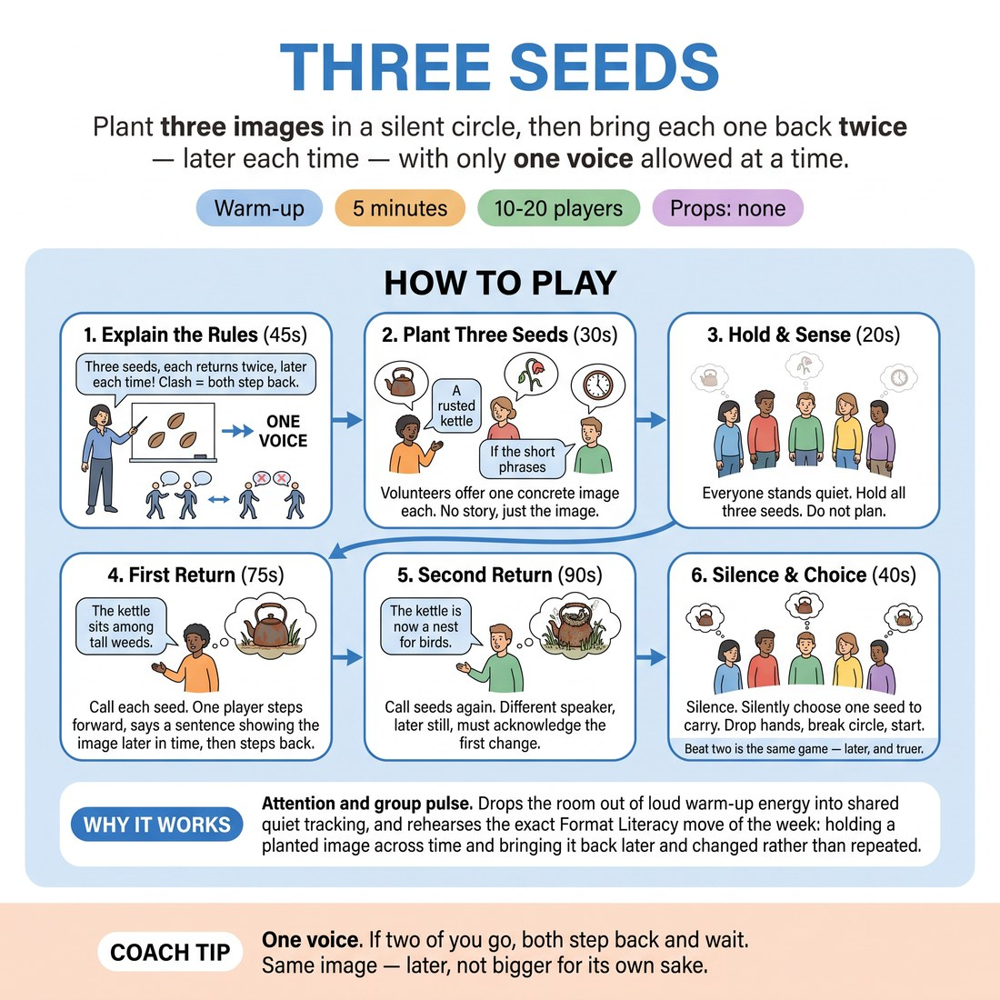

# Three Seeds

{ .infographic }

> Plant three images in a silent circle, then bring each one back twice — later each time — with only one voice allowed at a time.

`Players 10–20` · `~5 min` · `Complexity 3/5` · `Energy low` · `Contact none` · `Props: none`

## What it warms

Attention and group pulse. Drops the room out of loud warm-up energy into shared quiet tracking, and rehearses the exact Format Literacy move of the week: holding a planted image across time and bringing it back later and changed rather than repeated.

**Role in the cluster:** focus

## Setup

Standing circle, arms loose, no chairs in the way. Anyone who needs to sit takes a chair in the ring. No props.

## How to run it

1. (45s) Explain: three seeds get planted, then each comes back twice, later each time. One voice at a time. Clash means both step back and the seed waits.
2. (30s) Ask three volunteers for one seed each — a single concrete image in one breath. 'A rusted kettle.' No story, no joke, just the image.
3. (20s) Everyone stands still and quiet. Eyes soft, front of the circle. Hold all three seeds in your head. Do not plan a sentence.
4. (75s) Call 'Seed one', then two, then three. For each, one person steps forward a pace and says one sentence: the same image, later in time. Then steps back.
5. (90s) Call the seeds again in the same order. Second returns must be later still and must acknowledge what the first return changed. Different speaker each time.
6. (40s) Silence. Ask everyone to name silently which seed they would carry into a Harold today. Drop hands, break the circle, straight into the work.

## Side-coach

- *"One voice. If two of you go, both step back and wait."*
- *"Same image — later, not bigger for its own sake."*
- *"Let the silence sit. The room is thinking, not stuck."*
- *"Second return: what did the first one leave behind?"*
- *"Step forward to speak, step back when you're done."*

## Build it up

- Add a fourth seed and call the seeds out of order.
- Third pass: the return must fold two seeds together in one sentence.
- Silent returns — the speaker steps forward and shows the image later with body only, no words.

## If it stalls

- If nobody steps in for eight seconds, say the seed aloud again and add 'a year on'. A time stamp usually unsticks it.
- If the same three people take every return, say 'this pass is for people who haven't spoken yet' and wait it out.
- If the seeds are abstract nouns, swap them. Ask for something you could photograph.

## Ask afterwards

1. Which return felt like a real return, and which felt like a new idea wearing the same word?
2. What did you have to hold in your head to make the second return land?

## Scale

| Class size | What changes |
|---|---|
| 10–13 | One circle, three seeds, two return passes as written. |
| 14–17 | One circle, four seeds. Cut the second pass to seeds one and three only so the timing holds. |
| 18–20 | Split into two circles of nine or ten, each with its own three seeds. Run them at the same time; call the seed numbers loudly for both. Stay between the circles and police the one-voice rule. |

## Safety & inclusion

No contact. Nobody has to plant a seed or take a return — passing is silent and costs nothing. Chairs stay available in the ring for anyone who does not want to stand for five minutes.

## Lineage

In the Chicago long-form practice — the planted opening image and its later group-game return tradition. Long-form training often has the opening throw out images that the groups return to later. Stripped it to the bare tracking problem — no scenes, no groups, one sentence per return — so a proficient room rehearses the memory and patience a Harold return needs, without spending twenty minutes on it.
