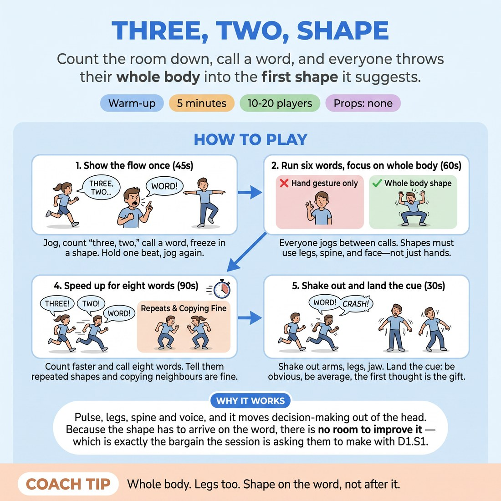

# Three, Two, Shape

{ .infographic }

> Count the room down, call a word, and everyone throws their whole body into the first shape it suggests.

`Players 10–20` · `~5 min` · `Complexity 1/5` · `Energy high` · `Contact none` · `Props: none`

## What it warms

Pulse, legs, spine and voice, and it moves decision-making out of the head. Because the shape has to arrive on the word, there is no room to improve it — which is exactly the bargain the session is asking them to make with D1.S1.

**Role in the cluster:** activation

## Setup

Clear the floor. Scatter everyone so each person can stretch both arms without touching anyone. You call all the words; have a rough list ready (kettle, giraffe, revenge, escalator, thunderstorm, wedding, bin day).

## How to run it

1. 45s: Show it once. Jog on the spot, count "three, two," call a word, freeze into a full-body shape on the word. Hold one beat. Jog again.
2. 60s: Run six words. Everyone jogs between calls. Shapes must be whole-body — legs, spine, face — not a hand gesture.
3. 75s: Run six more words. On the freeze, add one sound the shape would make. Sound and shape land together, not one after the other.
4. 90s: Speed up. Count "three, two" faster and call eight words. Tell them a repeated shape is fine and copying a neighbour is fine.
5. 30s: Shake out arms, legs, jaw. Land the cue: be obvious, be average, the first thought is the gift.

## Side-coach

- *"Whole body. Legs too."*
- *"Shape on the word, not after it."*
- *"Wrong shape is still a shape — hold it."*
- *"Don't audition it. Land it."*
- *"Keep the jog going between calls."*

## Build it up

- Shorten the countdown to "two" only, then to just the word.
- Call two words at once ("kettle — funeral") and make them commit to one shape that serves both.
- Let participants call the words, going round the scatter, so the caller is also improvising under pressure.

## If it stalls

- If shapes stay small and hand-sized, call three words in a row with no jog between — no time to shrink.
- If people freeze up entirely, tell them to copy whoever is nearest for one round. Copying restarts the body.
- If the room goes quiet on the sound round, call the sound yourself on the first two words and let them join.

## Ask afterwards

1. Which word gave you a shape before you decided anything?
2. What happened in your body on the words where you hesitated?

## Scale

| Class size | What changes |
|---|---|
| 10–13 | One scatter, everyone plays every round. Twenty words total across the session. |
| 14–17 | One scatter but widen the spacing; drop to five words per round so nobody is jogging longer than they can hold. |
| 18–20 | Split into two blocks facing each other across the room. Alternate calls: block A shapes while block B watches, then swap. Same word count, half the floor space each. |

## Safety & inclusion

Jogging on the spot is optional — marching or standing and bouncing the knees works the same. No contact; keep an arm's length clear on all sides. Nobody goes to the floor at speed. Anyone who needs to sit out watches from the edge and still calls sounds if they want.

## Lineage

In the Statue and freeze games from physical-theatre training tradition. Freeze-on-a-word drills are old and everywhere. We tied the freeze to a spoken noun rather than music stopping, so the body has to answer a prompt instantly, and added the sound layer to stop people polishing the shape in their head first.
