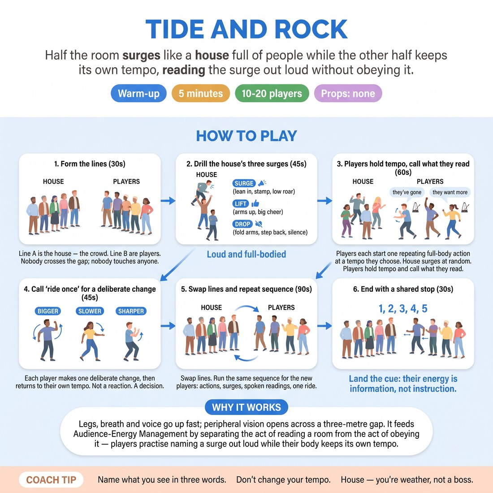

# Tide and Rock

{ .infographic }

> Half the room surges like a house full of people while the other half keeps its own tempo, reading the surge out loud without obeying it.

`Players 10–20` · `~5 min` · `Complexity 3/5` · `Energy high` · `Contact none` · `Props: none`

## What it warms

Legs, breath and voice go up fast; peripheral vision opens across a three-metre gap. It feeds Audience-Energy Management by separating the act of reading a room from the act of obeying it — players practise naming a surge out loud while their body keeps its own tempo.

**Role in the cluster:** activation

## Setup

Two lines facing each other, about three metres apart, everyone standing with room to swing their arms. Line A is the house, Line B is the players. No props.

## How to run it

1. (30s) Form the two lines. Line A is the house — the crowd. Line B are players. Nobody crosses the gap; nobody touches anyone.
2. (45s) Drill the house's three surges on your call: SURGE (lean in, stamp, low roar), LIFT (arms up, big cheer), DROP (fold arms, step back, silence). Loud and full-bodied.
3. (60s) Players each start one repeating full-body action at a tempo they choose — chopping, reaching, marching on the spot. House surges at random. Players hold tempo and call what they read: 'they've gone', 'they want more'.
4. (45s) Call 'ride once'. Each player makes one deliberate change — bigger, slower, sharper — then returns to their own tempo. Not a reaction. A decision.
5. (90s) Swap lines. Run the same sequence for the new players: actions, surges, spoken readings, one ride.
6. (30s) Both lines stamp together for five counts, then stop dead. Land the cue: their energy is information, not instruction.

## Side-coach

- *"Name what you see in three words. Don't change your tempo."*
- *"House — you're weather, not a boss."*
- *"Feet louder, tempo the same."*
- *"Ride it because you chose to, not because they pushed you."*
- *"Drop to silence. Notice what your body wants to do. Don't do it."*

## Build it up

- Split the house: half surge while half drop, at the same time. Players must still name one clear reading.
- Players give full sentences — 'they leaned in when I slowed down' — while keeping the action going.
- Give each player one ride per round only. They must pick their moment and say 'now' as they take it.

## If it stalls

- Players start copying the house. Freeze everyone, restate the one rule: your tempo is yours, your reading is out loud.
- The house is polite and small. Call the surges yourself on a count of three and demand full volume for one round before going random.

## Ask afterwards

1. When the house dropped to silence, what did your body try to do?
2. What's the difference between the reading you spoke and the choice you made?

## Scale

| Class size | What changes |
|---|---|
| 10–13 | One pair of lines, five or six a side. Run both swaps as written. |
| 14–17 | One pair of lines still, but appoint one person from each line to call the surges so you can watch the players' tempo. |
| 18–20 | Two facing pairs of lines in opposite corners, ten per corridor. Appoint a surge-caller in each. Run only one swap so it still lands in five minutes. |

## Safety & inclusion

Stamping is optional — offer a heel-press or a hand-slap on the thigh instead, and say so before you start. Keep the three-metre gap; no one crosses it. Check the floor is not slick.

## Lineage

Originally authored for this cluster. Crowd-noise warm-ups usually ask players to match the room's energy; this one splits reading from responding on purpose, so the surge becomes data rather than a command.
