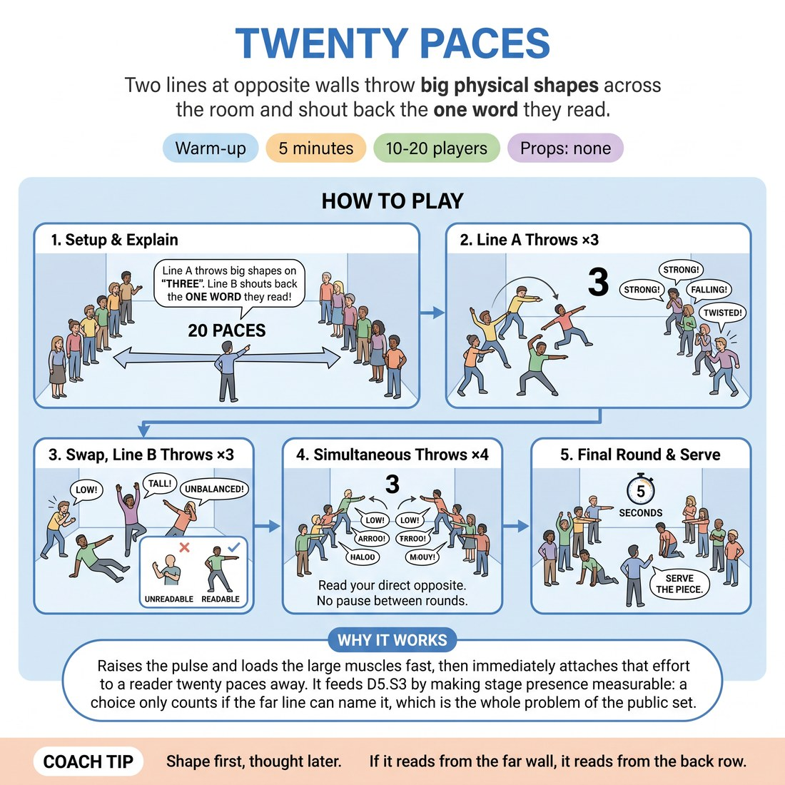

# Twenty Paces

{ .infographic }

> Two lines at opposite walls throw big physical shapes across the room and shout back the one word they read.

`Players 10–20` · `~5 min` · `Complexity 2/5` · `Energy high` · `Contact none` · `Props: none`

## What it warms

Raises the pulse and loads the large muscles fast, then immediately attaches that effort to a reader twenty paces away. It feeds D5.S3 by making stage presence measurable: a choice only counts if the far line can name it, which is the whole problem of the public set.

**Role in the cluster:** activation

## Setup

Clear the floor. Split the room in two and send each half to an opposite wall, facing in, spread along the wall with arm's length between neighbours. Everyone should be able to see the whole far line.

## How to run it

1. (40s) Explain: one line throws a full-body shape on your count; the facing line shouts back the single word they read. Big enough to land from twenty paces.
2. (60s) Line A throws on 'three'. Line B shouts one word each, ragged and loud. Repeat twice more, fast. No discussion between goes.
3. (70s) Swap. Line B throws three shapes, Line A reads them back. Push for shapes that use the floor and the ceiling, not just the arms.
4. (70s) Both lines throw at the same time on your count. Each person reads whoever is directly opposite them. Four rounds, no pause between.
5. (60s) Final round: throw a shape, hold it dead still for five seconds while the far line reads it, then drop. Twice. Call 'serve the piece' and move on.

## Side-coach

- *"Shape first, thought later."*
- *"If it reads from the far wall, it reads from the back row."*
- *"Hold it. Let them finish reading you."*
- *"Whole body. Arms alone are not a choice."*
- *"Shout the first word you see, not the best word."*

## Build it up

- Ban symmetry. Every shape must be off-centre or off-balance, which forces weight into the floor and reads harder from distance.
- Add one syllable of sound on the drop of each shape, thrown to the far wall, not muttered.
- Chain three shapes in three seconds — throw, change, change — and the reader calls the word for the last one only.

## If it stalls

- Shapes go small and polite. Name it: tell them the far line can only read the silhouette, so make a silhouette.
- Readers hesitate looking for a clever word. Allow 'unclear' as a legal shout — it is useful information for the thrower.

## Ask afterwards

1. Which of your shapes got read the way you meant it, and what was different about that one?
2. What did you drop to make yourself legible from twenty paces?

## Scale

| Class size | What changes |
|---|---|
| 10–13 | One pair of lines across the widest part of the room. Run three shapes per line in steps 2 and 3 as written. |
| 14–17 | One pair of lines still. Cut to two shapes per line in steps 2 and 3 so nobody waits, and keep step 4 at four rounds. |
| 18–20 | Split into two separate pairs of lines running at right angles to each other, each with its own count — take one yourself and give the other to a confident participant. Both stop together at five minutes. |

## Safety & inclusion

No contact. Keep an arm's length gap along each line and stay inside your own footprint. Jumping and floor-level shapes are optional at every stage; say so before you start, and say that anyone can throw seated or standing shapes only.

## Lineage

In the Physical theatre shape-throwing drills tradition. The common drill is a solo shape thrown to a coach. Here the shape is thrown across a room at a live reader who calls back what landed, so clarity is tested by distance and by a second pair of eyes rather than judged by the teacher.
