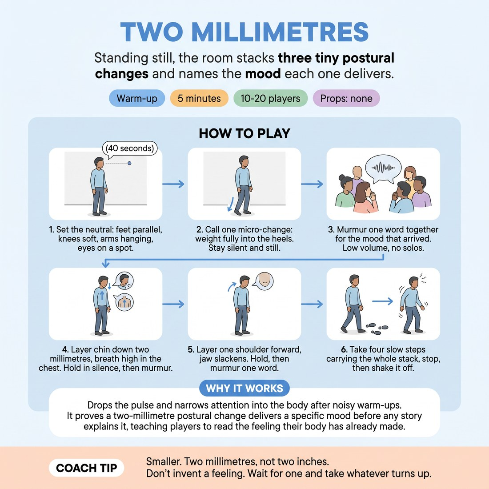

# Two Millimetres

{ .infographic }

> Standing still, the room stacks three tiny postural changes and names the mood each one delivers.

`Players 10–20` · `~5 min` · `Complexity 2/5` · `Energy low` · `Contact none` · `Props: none`

## What it warms

Drops the pulse and narrows attention into the body after the noisier warm-ups. Feeds Emotional Fluidity by proving the point of the session in miniature: a two-millimetre postural change delivers a specific mood before any story explains it, so players learn to read the feeling their body has already made.

**Role in the cluster:** focus

## Setup

Scatter everyone facing one blank wall, an arm's length apart, nobody behind anyone's shoulder. No chairs, no props. You walk the back of the room and speak the calls quietly.

## How to run it

1. Set the neutral: feet parallel under hips, knees soft, arms hanging, eyes on a spot on the wall. Silence from here. (40 seconds)
2. Call one micro-change and hold it: weight fully into the heels. Two millimetres of shift, not a pose. Everyone stays silent and still. (45 seconds)
3. On your cue, the whole room murmurs one word for the mood that arrived. All together, low volume, no solos. (20 seconds)
4. Layer the second change on top: chin down two millimetres, breath high in the chest. Hold in silence, then murmur one word together. (65 seconds)
5. Layer the third: one shoulder drifts forward, jaw slackens. Hold, then murmur one word together. (65 seconds)
6. Have everyone take four slow steps forward carrying the whole stack, stop, then shake it off and stand neutral again. (65 seconds)

## Side-coach

- *"Smaller. Two millimetres, not two inches."*
- *"Don't invent a feeling. Wait for one and take whatever turns up."*
- *"Keep the knees soft. Breathe."*
- *"Murmur it, don't perform it."*
- *"Shake it out. Nothing sticks to you."*

## Build it up

- Add a breath rule to each layer — short and high, or long and low — and see which shifts the mood more, the posture or the breath.
- Instead of one word, each person speaks a full sentence in the voice that body wants, still murmured, still all at once.
- Turn the ranks to face each other for the final hold. Nobody speaks; each person silently picks one other body in the room and decides who that person is.

## If it stalls

- If people report nothing, widen the contrast: weight all the way back onto the heels, then all the way onto the balls of the feet, and ask which one they'd rather be in.
- If someone can't find a word, let them say 'nothing yet' on the murmur. That is an honest answer and the next layer usually solves it.
- If the room fidgets or giggles, drop your own volume rather than raising it, and add five seconds to the hold.

## Ask afterwards

1. Which of the three changes shifted the most for you, and did you expect that one?
2. Did the feeling arrive before or after you had a word for it?

## Scale

| Class size | What changes |
|---|---|
| 10–13 | One rank facing the wall, arm's length apart. Run all three layers as written. |
| 14–17 | Two staggered ranks, back rank standing in the gaps of the front. Same three layers; walk between the ranks so everyone hears the calls. |
| 18–20 | Three staggered ranks or split the room to face two opposite walls. Cut the four steps in step 6 to two steps so the murmurs stay audible and the timing holds. |

## Safety & inclusion

Sustained standing stillness makes some people light-headed. Tell them to keep knees unlocked, breathe normally, and step out or sit down at any point with no explanation. No contact in this one; nobody stands directly behind anyone else.

## Lineage

In the Physical actor training that builds character from posture and body centre tradition. Posture-first character work usually asks for large committed shapes. Shrunk it to near-invisible adjustments held in silence so it lands as a focus piece rather than another activation, and added the shared murmur so nobody names a feeling alone.
