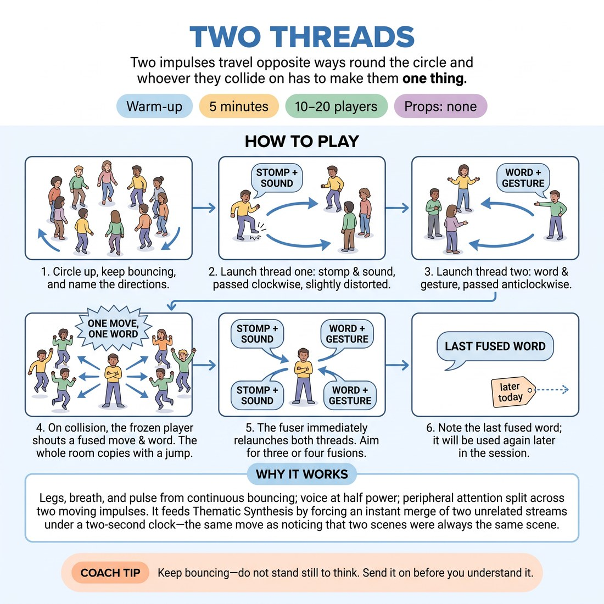

# Two Threads

{ .infographic }

> Two impulses travel opposite ways round the circle and whoever they collide on has to make them one thing.

`Players 10–20` · `~5 min` · `Complexity 3/5` · `Energy high` · `Contact none` · `Props: none`

## What it warms

Legs, breath and pulse from continuous bouncing and stomping; voice at half power; peripheral attention split across two moving impulses at once. It feeds Thematic Synthesis by forcing an instant merge of two unrelated streams under a two-second clock — the same move as noticing that two scenes were always the same scene.

**Role in the cluster:** activation

## Setup

One circle, arm's length between people, floor clear. No props. If the floor is hard or hollow, tell people to press the feet down rather than stomp.

## How to run it

1. (40s) Circle up. Everyone bounces lightly on the balls of the feet and keeps bouncing all the way through. Name the two directions out loud: clockwise, anticlockwise.
2. (40s) Launch thread one clockwise: a stomp plus a sound. Each person copies what they received, then sends it on slightly distorted. Run it half a lap.
3. (40s) Launch thread two anticlockwise from the far side: a single word with an arm gesture, passed by association. Run it half a lap. Stop both.
4. (2m) Run both threads at once. When they land on the same person, that person freezes, then shouts one move-and-word built out of both. The whole room copies it with a jump.
5. (40s) The fuser immediately relaunches both threads, one in each direction. Keep going. Aim for three or four fusions.
6. (20s) Take the last fused word. Say it back once as a room, and tell them you will be asking for it later in the session.

## Side-coach

- *"Keep bouncing — do not stand still to think."*
- *"Send it on before you understand it."*
- *"Fusion: both threads, one thing, out loud."*
- *"Wrong fusion is fine. Justify it with your body."*
- *"Whole room jumps on every fusion."*

## Build it up

- Add a third thread — a clapped rhythm — travelling clockwise. Fusions now need all three ingredients.
- Silence the fuser: they fuse with the body only, and the room supplies the word by shouting it together.
- Require every fusion after the first to carry something from an earlier fusion. The threads start dragging the whole history round the circle.

## If it stalls

- If the fuser goes blank, count them in — room shouts three, two, one — and take whatever comes out. Any nonsense is a legal fusion.
- If the threads keep sliding past each other, restart them only four people apart so collisions come fast.
- If distortion kills the thread, tell them to copy exactly for two people, then change one thing.

## Ask afterwards

1. What did you do when two things that had nothing to do with each other landed on you?
2. Which fusion did the room commit to hardest, and why that one?

## Scale

| Class size | What changes |
|---|---|
| 10–13 | One circle. Threads start opposite each other. Expect four fusions in the two minutes. |
| 14–17 | One circle. Start the threads a third of the way apart, not opposite, or collisions come too slowly. Expect three fusions. |
| 18–20 | Two circles of nine or ten, side by side, each running its own pair of threads. In the last twenty seconds each circle shouts its final fusion at the other, and both rooms copy both. |

## Safety & inclusion

Stomping is optional — pressing the foot flat counts. Anyone with knee, ankle or back trouble bounces from the ankles or stays still and passes with the arms only. No contact at any point. Voices at speaking volume; nobody needs to strain.

## Lineage

In the Circle pass-and-clap games from general theatre-games practice tradition. Two-direction pass games usually score the collision as a mistake or an elimination. We made the collision the point: the person caught by both threads must merge them into a single image the room then adopts, which is reincorporation in miniature.
