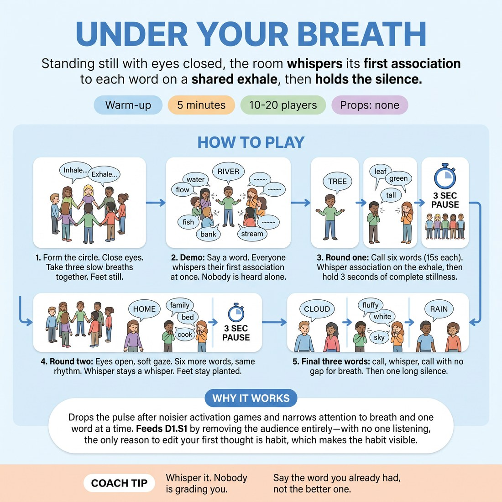

# Under Your Breath

{ .infographic }

> Standing still with eyes closed, the room whispers its first association to each word on a shared exhale, then holds the silence.

`Players 10–20` · `~5 min` · `Complexity 1/5` · `Energy low` · `Contact none` · `Props: none`

## What it warms

Drops the pulse after the noisier activation games and narrows attention to breath and one word at a time. Feeds D1.S1 by removing the audience entirely — with no one listening, the only reason to edit your first thought is habit, which makes the habit visible.

**Role in the cluster:** focus

## Setup

One circle, arm's length apart, everyone standing with hands loose at their sides. No props. Say up front that eyes can stay open with a soft gaze on the floor if closing them is uncomfortable.

## How to run it

1. 45s: Form the circle. Everyone closes eyes or drops gaze. Three slow breaths together, in through the nose, out through the mouth. Feet still, shoulders down.
2. 30s: Demo. Say a word. On the next shared out-breath, whisper your own first association. Everyone whispers at once, so nobody is heard alone.
3. 90s: Round one, eyes closed. Call six words, one every fifteen seconds. Everyone whispers their association on the exhale, then holds three seconds of complete stillness before the next word.
4. 90s: Round two, eyes open, soft gaze across the circle. Six more words, same rhythm. Whisper stays a whisper. Feet stay planted.
5. 45s: Final three words with no gap for breath — call, whisper, call. Then one long silence. Give the cue and move on.

## Side-coach

- *"Whisper it. Nobody is grading you."*
- *"Say the word you already had, not the better one."*
- *"Hold the silence. Don't shuffle."*
- *"Breathe out, then speak. Not before."*
- *"Be obvious. Be average. Your first thought is the gift."*

## Build it up

- Cut the gap between words from fifteen seconds to five. Same whisper, no room to shop for a better answer.
- Switch the prompt from single words to short phrases — 'the smell of a hospital', 'the last day of a holiday'. Longer prompt, same one-word answer.
- Ask for the association to the association: after each whisper, call 'again' and they whisper the next word off their own last one, three deep.

## If it stalls

- If the whispers arrive late and scattered, people are editing. Name it plainly: the whisper is anonymous, so the only person you can cheat is yourself. Run three fast words with no pause.
- If the circle giggles and the stillness collapses, that's fine — let it pass, then restart with two silent breaths before the next word.
- If someone freezes and says nothing, keep calling. Do not stop for them. Most people rejoin by the third word.

## Ask afterwards

1. Did you swap your first word for a second one? What was wrong with the first one?
2. What did the three seconds of silence feel like — rest, or pressure?

## Scale

| Class size | What changes |
|---|---|
| 10–13 | One circle. Call all fifteen words yourself from inside the circle. |
| 14–17 | One wider circle. Step into the centre so your voice reaches everyone, and lengthen each call slightly. |
| 18–20 | Two concentric circles, inner facing out, outer facing in. Same fifteen words, same timings; the doubled whisper is louder, which helps people hide and speak. |

## Safety & inclusion

Eyes closed is optional — a soft downward gaze works identically, and say so before you start. Nobody moves from their spot, so there is no contact and no collision risk. Anyone who prefers to sit can sit.

## Lineage

In the Word-association drills used across improv and actor training tradition. Word-association is old and everywhere. What is set here is the frame: whispered in unison so no individual is audible, tied to a shared exhale, and bracketed by enforced stillness. That turns a fast circle game into a focus exercise that lands the room quiet before scene work.
