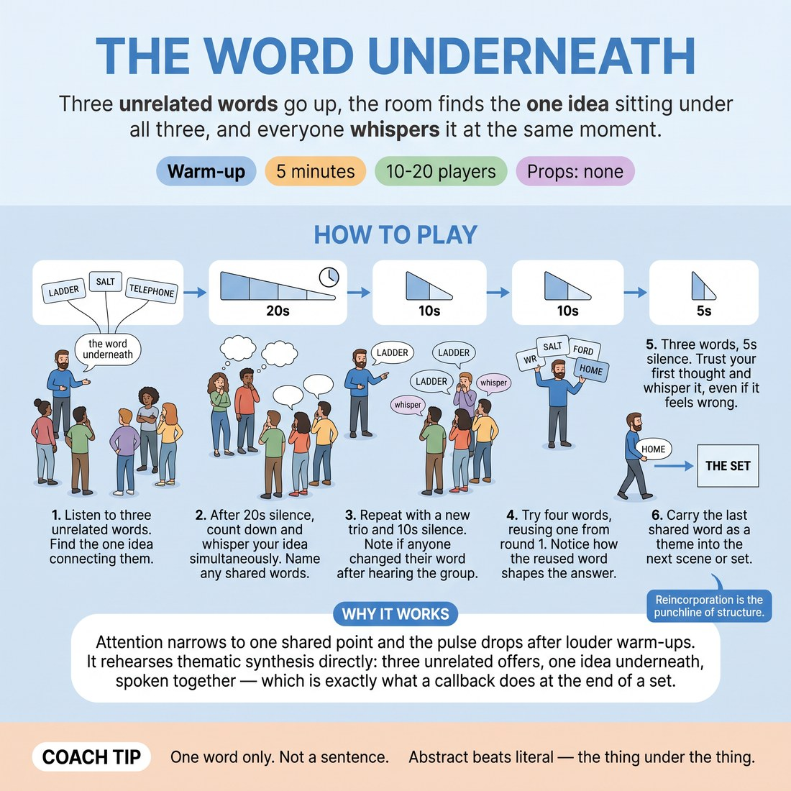

# The Word Underneath

{ .infographic }

> Three unrelated words go up, the room finds the one idea sitting under all three, and everyone whispers it at the same moment.

`Players 10–20` · `~5 min` · `Complexity 2/5` · `Energy low` · `Contact none` · `Props: none`

## What it warms

Attention narrows to one shared point and the pulse drops after the louder warm-ups. It rehearses thematic synthesis directly: three unrelated offers, one idea underneath, spoken together — which is exactly what a callback does at the end of a set.

**Role in the cluster:** focus

## Setup

Bring everyone into one loose standing cluster, shoulders roughly level, all facing you. No circle, no walking. Have three or four unrelated nouns ready in your head before you start.

## How to run it

1. Setup, 45 seconds. Tell them: you say three unrelated words, they find privately the one idea that holds all three, then on your count everyone whispers their idea at the same time.
2. Round one, 75 seconds. Say three words slowly — 'ladder, salt, telephone'. Twenty seconds of silence. Count three, everyone whispers one word. Name aloud any word you heard twice.
3. Round two, 60 seconds. New trio, ten seconds of silence only. Whisper together. Ask who changed their word after hearing the room, and move straight on.
4. Round three, 60 seconds. Four words this time, one of them reused from round one. Ten seconds. Whisper. Point out that the reused word bent the answer.
5. Round four, 40 seconds. Three words, five seconds, whisper. Take the first thought and let it be wrong.
6. Close, 20 seconds. Say the last shared word back to the room and tell them to carry it into the set.

## Side-coach

- *"One word only. Not a sentence."*
- *"Abstract beats literal — the thing under the thing."*
- *"Don't hunt for clever. Take what arrives."*
- *"Whisper, so you can hear other people."*
- *"Nobody wins this. Overlaps are just interesting."*

## Build it up

- Cut the thinking silence to three seconds so the first thought is the only thought available.
- Ban concrete nouns in the answer — the whispered word must be an abstraction.
- Run trios back to back without stopping and ask them to keep the previous round's answer in play as a fourth word.

## If it stalls

- If everyone whispers something literal and flat, change the trio to one concrete, one abstract, one verb — 'anchor, forgiveness, spilling' — and it opens up.
- If nobody speaks at the count, count louder and shorter: 'three, two, one, now.' Silence usually means they are still editing.
- Some rounds produce zero overlap. Say so plainly, don't manufacture a pattern, and run the next trio.

## Ask afterwards

1. What made you drop your first word for someone else's?
2. Where in a long set does this same move happen?

## Scale

| Class size | What changes |
|---|---|
| 10–13 | One cluster, four rounds as written. You will hear individual words clearly, so name two or three overlaps each round. |
| 14–17 | One cluster, but split it down the middle. Half whispers, half listens and reports back what they heard; swap after round two. |
| 18–20 | Two clusters of roughly ten, standing three metres apart facing each other. Alternate rounds — one whispers, one listens — and after round four ask whether the two clusters landed near the same idea. |

## Safety & inclusion

No contact and no movement. Anyone who would rather not vocalise can mouth the word silently or listen only; say this before round one. Keep whispers quiet so nobody is shouted over.

## Lineage

In the Association and A-to-C work common in long-form training tradition. Built from scratch. Standard association drills run one person at a time round a circle; this one has the whole room answer simultaneously so the group hears its own convergence, which is the actual skill in week five. The reused word in round three is added to rehearse reincorporation deliberately.
